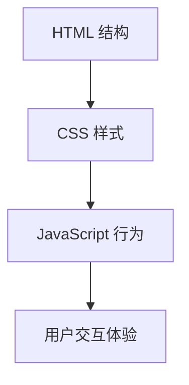

# 6.3 JavaScript 基础

<div align="center">

**第六章 · Web 前端开发基础 · 第 3 节**

*预计学习时间：2 小时 · 难度：⭐⭐⭐*

</div>


---

## 📖 本节导读

- ✅ 理解 JavaScript 的作用与引入方式
- ✅ 掌握变量、数据类型、函数
- ✅ 学会操作页面标签元素

---

## 1. 什么是 JavaScript？

> 🟦 **知识卡片**
>
> **JavaScript**（简称 JS）运行在浏览器端，由浏览器解释执行，负责网页的**交互行为**。



| 技术 | 职责 |
|------|------|
| HTML | 网页结构（钢筋骨架） |
| CSS | 网页样式（装修油漆） |
| JavaScript | 网页行为（开关灯门窗） |

---

## 2. 三种引入方式

| 方式 | 写法 | 场景 |
|------|------|------|
| **行内式** | `onclick="alert('点了')"` | 简单事件 |
| **内嵌式** | `<script>代码</script>` | 学习阶段 |
| **外链式** | `<script src="js/main.js"></script>` | 公司开发 |

```html
<!DOCTYPE html>
<html>
<head>
    <meta charset="UTF-8">
    <title>JS 入门</title>
    <!-- 内嵌式 -->
    <script>
        alert("我是内嵌式的 JS");
    </script>
    <!-- 外链式 -->
    <script src="js/main.js"></script>
</head>
<body>
    <!-- 行内式 -->
    <input type="button" value="按钮" onclick="alert('你点我了！')">
</body>
</html>
```

> 📸 **截图位**：点击按钮弹出 alert 对话框

---

## 3. 变量与数据类型

### 3.1 定义变量

JavaScript 是**弱类型语言**，用 `var` 定义变量，类型由值决定：

```javascript
var iNum = 1;
var sName = "李四";
var bIsOk = true;
```

### 3.2 六种数据类型

| 类型 | 说明 | 示例 |
|------|------|------|
| `number` | 数字 | `1`, `2.5` |
| `string` | 字符串 | `"hello"` |
| `boolean` | 布尔 | `true`, `false` |
| `undefined` | 未初始化 | `var x;` |
| `null` | 空对象 | `var o = null` |
| `object` | 对象 | `{name: "老王", age: 88}` |

```javascript
var oPerson = {
    name: "隔壁老王",
    age: 88
};
alert(typeof(iNum));    // "number"
alert(typeof(sName));   // "string"
alert(typeof(oPerson)); // "object"
```

**运行效果：**

```
（浏览器依次弹出 number、string、object）
```

### 3.3 命名规范

- 区分大小写
- 首字符必须是字母、`_` 或 `$`
- 推荐使用匈牙利命名：`sName`（字符串）、`iNum`（数字）、`oDiv`（对象）

---

## 4. 函数

```javascript
// 无参数无返回值
function fnShow() {
    alert('我是一个函数');
}
fnShow();

// 有参数有返回值
function fnSum(iNum1, iNum2) {
    var iResult = iNum1 + iNum2;
    return iResult;
    // return 后面的代码不会执行
}

var iNum = fnSum(1, 2);
alert(iNum);  // 3
```

**运行效果：**

```
3
```

> 🟦 **技巧**：`return` 有两个作用——返回值 + 结束函数执行。

---

## 5. 变量作用域

| 类型 | 定义位置 | 使用范围 |
|------|---------|---------|
| **局部变量** | 函数内部 | 只能在函数内使用 |
| **全局变量** | 函数外部 | 所有函数都能访问 |

```javascript
var iNum = 1;  // 全局变量

function fnModify() {
    iNum = 3;
    iNum++;
    alert(iNum);  // 4
}

fnModify();
alert("函数外：" + iNum);  // 4
```

---

## 6. 条件语句

```javascript
var iScore = 80;

if (iScore < 60) {
    alert("不及格");
} else if (iScore <= 70) {
    alert("刚及格");
} else if (iScore <= 80) {
    alert("一般般");
} else {
    alert("优秀");
}
```

### 比较与逻辑运算符

| 比较 | 逻辑 |
|------|------|
| `==` 等于 | `&&` 与 |
| `===` 全等（值+类型） | `\|\|` 或 |
| `!=` 不等于 | `!` 非 |
| `> < >= <=` | |

> ⚠️ **避坑**：JS 中数字和字符串比较时，会自动把字符串转成数字。用 `===` 可避免隐式转换。

---

## 7. 循环语句

```javascript
var aArray = [1, 3, 9];

// for 循环
for (var index = 0; index < aArray.length; index++) {
    alert(aArray[index]);
}

// while 循环
var index = 0;
while (index < aArray.length) {
    alert(aArray[index]);
    index++;
}

// do-while（至少执行 1 次）
do {
    alert(aArray[index]);
    index++;
} while (index < aArray.length);
```

---

## 8. 数组

```javascript
// 创建数组
var aArray1 = new Array(1, 2, 3);
var aArray2 = [3, 6, 9];
var aArray3 = [[1, 2, 3], [4, 5, 6]];  // 多维数组

alert(aArray2.length);   // 3
alert(aArray2[2]);       // 9
aArray2.push('hello');   // 末尾追加
aArray2.pop();           // 删除最后一个
aArray2.splice(1, 0, '鸭梨', '香蕉');  // 插入
```

**运行效果：**

```
3
9
```

---

## 9. 操作页面元素

### 9.1 获取标签

```javascript
window.onload = function() {
    var oBtn = document.getElementById("btn1");
    var oP   = document.getElementById("p1");
};
```

> ⚠️ **避坑**：JS 写在元素**上面**会报错——页面从上往下加载，元素还没出现就获取会返回 `null`。用 `window.onload` 等页面加载完再操作。

### 9.2 操作属性

```javascript
// 读取属性
alert(oBtn.type);
alert(oBtn.value);

// 设置属性
oBtn.name = "username";
oBtn.className = "btnstyle";       // class 写成 className
oBtn.style.fontSize = "30px";    // font-size 写成 fontSize
```

### 9.3 操作内容

```javascript
var oDiv = document.getElementById("div1");
alert(oDiv.innerHTML);                              // 获取内容
oDiv.innerHTML = "<a href='http://www.baidu.com'>百度</a>";  // 设置内容
```

```html
<input type="button" value="按钮" id="btn1">
<p id="p1">哈哈，我是一个段落标签</p>
<div id="div1">不要睡觉！</div>
```

> 📸 **截图位**：点击按钮改变段落文字颜色的效果

---

## 10. 动手练习

创建一个「计数器」页面：

1. 一个显示数字的 `<div>`
2. 两个按钮：「+1」和「-1」
3. 用 JS 获取元素，点击按钮修改数字
4. 数字为 0 时变红色，大于 0 变绿色

> 📸 **截图位**：计数器页面交互效果

---

## 11. 本节小结

| 类别 | 核心知识 |
|------|---------|
| 引入 | 外链式 `<script src="">` |
| 变量 | `var` + 六种数据类型 |
| 函数 | `function` + `return` |
| 流程 | `if/else`、for、while |
| DOM | `getElementById` + `innerHTML` |

---

| ← 上一节 | [第六章目录](./README.md) | 下一节 → |
|---------|--------------------------|---------|
| [6.2 CSS 基础](./02-CSS基础.md) | | [6.4 jQuery 与 Ajax](./04-jQuery与Ajax.md) |

*源码：[`web前端开发基础/JavaScript基础/`](../../web前端开发基础/JavaScript基础/)*
