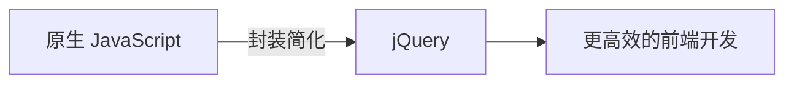
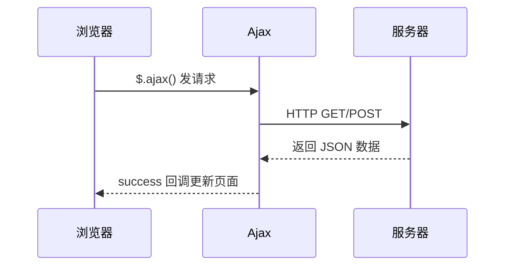
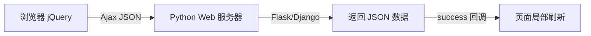

# 6.4 jQuery 与 Ajax

<div align="center">

**第六章 · Web 前端开发基础 · 第 4 节**

*预计学习时间：1.5 小时 · 难度：⭐⭐⭐*

</div>


---

## 📖 本节导读

- ✅ 理解 jQuery 的作用与引入方式
- ✅ 掌握选择器、事件、DOM 操作
- ✅ 学会 Ajax 异步请求与 JSON 数据格式

---

## 1. 什么是 jQuery？

> 🟦 **知识卡片**
>
> **jQuery** 是对 JavaScript 的封装，免费开源的 JS 函数库，极大简化了 JS 编程。



| 优点 | 说明 |
|------|------|
| 兼容主流浏览器 | 减少兼容性调试 |
| 代码更简洁 | 一行 jQuery ≈ 多行原生 JS |

jQuery 和 JavaScript 职责相同——负责网页交互，只是 jQuery 写起来更简单。

---

## 2. 引入与入口函数

```html
<!-- 1. 引入 jQuery -->
<script src="js/jquery-1.12.4.min.js"></script>

<!-- 2. 写 jQuery 代码（新开 script 标签） -->
<script>
    $(function() {
        var $div = $("#div1");
        alert($div);
    });
</script>
```

### 入口函数对比

| | `window.onload` | `$(document).ready()` / `$(function(){})` |
|---|----------------|------------------------------------------|
| 等待内容 | 页面**所有资源**（含图片） | 只需 **DOM 结构** |
| 执行次数 | 只执行一次，重复会被覆盖 | 可多次执行 |
| 速度 | 较慢 | **更快** |

```javascript
// 原生 JS
window.onload = function() {
    var oDiv = document.getElementById("div1");
};

// jQuery（推荐简写）
$(function() {
    var $div = $("#div1");
});
```

> 🟦 **技巧**：`$` 是 jQuery 的象征，变量名建议以 `$` 开头，如 `$div`、`$btn`。

> 📸 **截图位**：jQuery 成功获取 div 元素的 alert 弹窗

---

## 3. jQuery 选择器

选择规则和 CSS 完全一致：

| 选择器 | 写法 | 示例 |
|--------|------|------|
| 标签 | `$("p")` | 所有 p 标签 |
| 类 | `$(".div1")` | class 为 div1 |
| id | `$("#box1")` | id 为 box1 |
| 层级 | `$("div h1")` | div 下的 h1 |
| 属性 | `$("input[type=text]")` | type 为 text 的 input |

```javascript
$(function() {
    var $p = $("p");
    $p.css({"color": "red"});

    var $div  = $(".div1");
    var $box  = $("#box1");
    var $h1   = $("div h1");
    var $input = $("input[type=text]");

    alert($p.length);  // 匹配到的元素个数
});
```

---

## 4. 操作元素内容与属性

```javascript
$(function() {
    var $div = $("div");

    // 获取/设置 HTML 内容
    alert($div.html());
    $div.html("<a href='https://www.baidu.com'>百度</a>");
    $div.append("<a href='https://www.google.com'>谷歌</a>");

    // 样式属性 → css()
    $p.css({"font-size": "30px", "background": "green"});

    // 其他属性 → prop()
    $text.prop({"value": "张三", "class": "tname"});

    // value 属性 → val()
    alert($text.val());
    $text.val("王五");
});
```

| 方法 | 作用 |
|------|------|
| `.html()` | 获取/设置标签内容 |
| `.append()` | 追加内容 |
| `.css()` | 操作样式属性 |
| `.prop()` | 操作其他属性 |
| `.val()` | 获取/设置 value |

---

## 5. jQuery 事件

| 事件 | 作用 |
|------|------|
| `click()` | 鼠标单击 |
| `focus()` | 获取焦点 |
| `blur()` | 失去焦点 |
| `mouseover()` | 鼠标进入 |
| `mouseout()` | 鼠标离开 |

```javascript
$(function() {
    var $lis = $("ul li");
    var $btn = $("#btn1");
    var $text = $("#txt1");

    // 点击 li 变红
    $lis.click(function() {
        $(this).css({"color": "red"});
        alert($(this).index());
    });

    // 点击按钮获取输入框内容
    $btn.click(function() {
        alert($text.val());
    });

    // 焦点事件
    $text.focus(function() {
        $(this).css({"background": "red"});
    });
    $text.blur(function() {
        $(this).css({"background": "white"});
    });
});
```

```html
<ul>
    <li>苹果</li>
    <li>鸭梨</li>
    <li>香蕉</li>
</ul>
<input type="text" id="txt1">
<input type="button" id="btn1" value="你点我">
```

> 📸 **截图位**：点击列表项变红 + 输入框焦点变色效果

---

## 6. JSON 数据格式

> 🟦 **知识卡片**
>
> **JSON**（JavaScript Object Notation）是轻量级数据交换格式，前后端通信的标准格式，逐渐替代 XML。

### 6.1 两种格式

**对象格式**（一对大括号）：

```json
{"name": "李四", "age": 20}
```

**数组格式**（一对中括号）：

```json
[{"name": "李四", "age": 20}, {"name": "李三", "age": 21}]
```

> ⚠️ **避坑**：JSON 的 key 和字符串值必须用**双引号**，单引号会导致解析错误。

### 6.2 转换为 JS 对象

```javascript
var sJson = '{"name":"李四","age":20}';
var oPerson = JSON.parse(sJson);
console.log(oPerson.name);  // 李四
```

Python 后端返回的 JSON，前端用 `JSON.parse()` 解析；Python 端可用 `json.loads()` 解析。

---

## 7. Ajax 异步请求

> 🟦 **知识卡片**
>
> **Ajax** 让 JavaScript 发送异步 HTTP 请求与后台通信，最大优点是**局部刷新**——不用整页重载。



### 7.1 `$.ajax()` 完整写法

```javascript
$.ajax({
    url: "data.json",
    type: "GET",
    dataType: "json",
    data: {"name": "ls"},
    success: function(data) {
        console.log(data.name);
        // 局部刷新：把数据绑定到页面标签
    },
    error: function() {
        alert("请求失败");
    },
    async: true  // 异步（默认）
});
```

| 参数 | 说明 |
|------|------|
| `url` | 请求地址 |
| `type` | 请求方式，默认 `GET` |
| `dataType` | 返回数据格式，常用 `json` |
| `data` | 发送给服务器的数据 |
| `success` | 成功回调函数 |
| `error` | 失败回调函数 |
| `async` | 是否异步，默认 `true` |

### 7.2 简写方式

```javascript
// GET 简写
$.get("data.json", {"name": "ls"}, function(data) {
    alert(data.name);
}, "json");

// POST 简写
$.post("data.json", {"name": "ls"}, function(data) {
    alert(data.name);
}, "json");
```

**运行效果：**

```
李四
（浏览器弹出 alert 显示服务器返回的 name 字段）
```

> ⚠️ **避坑**：Ajax 需要在 **Web 服务器环境**下运行（如 `python -m http.server`），直接双击 HTML 文件可能跨域失败。

### 7.3 同步 vs 异步

| | 同步 | 异步 |
|---|------|------|
| 行为 | 等上一个请求完成才发下一个 | 多个请求同时发出 |
| 类比 | 线程同步 | 线程异步 |
| 默认 | — | `async: true`（推荐） |

---

## 8. 与 Python 后端的联系



这正是后续 Django / Flask 项目前后端交互的基础：

- 前端用 `$.ajax()` 或 `$.get()` 发请求
- 后端返回 JSON 格式数据
- 前端在 `success` 回调中更新页面

---

## 9. 动手练习

创建一个「天气查询」页面：

1. 引入 jQuery
2. 一个输入框 + 查询按钮
3. 点击按钮用 `$.get()` 请求本地 `data.json`
4. 在 `success` 回调中把城市名和温度显示到页面上

`data.json` 示例：

```json
{"city": "北京", "temp": 25, "weather": "晴"}
```

> 📸 **截图位**：点击查询后页面显示天气信息的局部刷新效果

---

## 10. 本章小结

| 类别 | 核心知识 |
|------|---------|
| jQuery | `$()` 选择器，比原生 JS 简洁 |
| 入口 | `$(function(){})` 比 onload 更快 |
| 操作 | `.html()` `.css()` `.val()` `.click()` |
| JSON | 双引号、对象/数组两种格式 |
| Ajax | `$.ajax()` / `$.get()` 实现局部刷新 |

前端三板斧（HTML + CSS + JavaScript/jQuery）到此全部掌握。后续 Django 项目中，你将用 Ajax 与 Python 后端进行数据交互。

---

| ← 上一节 | [第六章目录](./README.md) | 下一章 → |
|---------|--------------------------|---------|
| [6.3 JavaScript 基础](./03-JavaScript基础.md) | | [第七章 MySQL](07-MySQL数据库/README.md) |

*源码：[`web前端开发基础/JQuery/`](https://github.com/Drgonmancer/Leo_code/tree/main/web前端开发基础/JQuery)*
