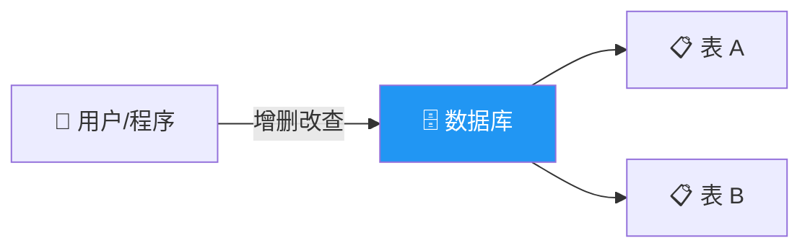
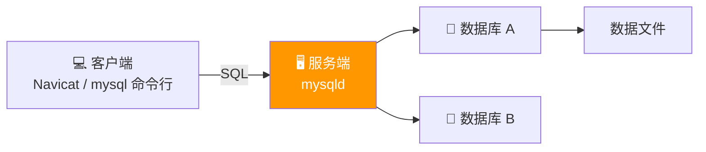
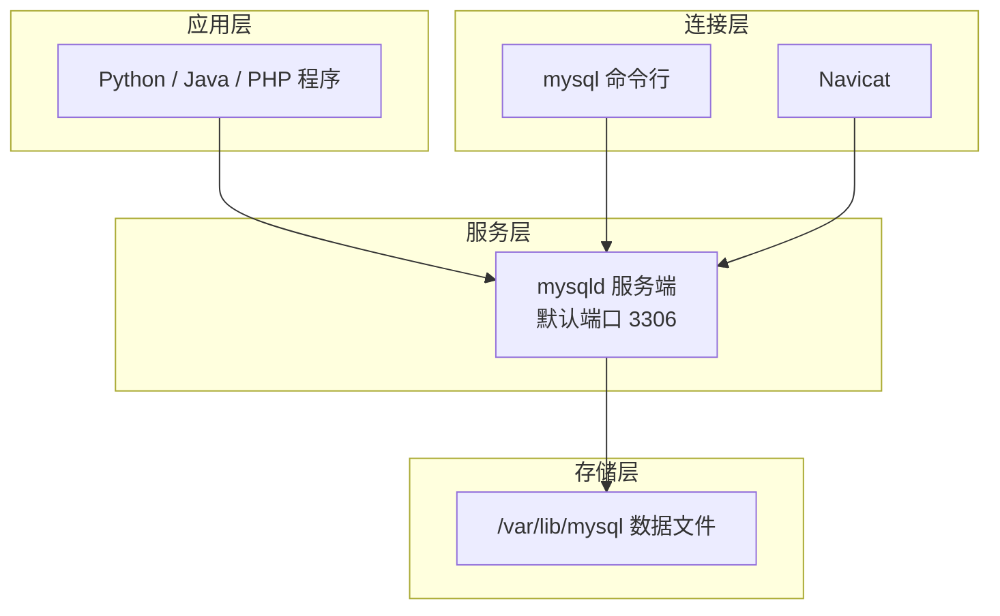

# 7.1 MySQL 介绍

<div align="center">

**第七章 · MySQL 数据库 · 第 1 节**

*预计学习时间：1 小时 · 难度：⭐*

</div>


---

## 📖 本节导读

数据库是后端开发的**核心基础设施**。本节从「什么是数据库」讲起，搞懂关系型 vs 非关系型、RDBMS 架构、SQL 语言分类，以及 MySQL 的安装与服务管理——为后续建表、查询、Python 交互打下基础。


| 你将学会 | 核心关键词 |
|----------|-----------|
| 理解数据库的作用与分类 | 关系型、NoSQL |
| 搞懂客户端-服务端模型 | RDBMS、SQL |
| 掌握 MySQL 服务管理 | `service mysql`、配置文件 |
| 使用命令行登录数据库 | `mysql -uroot -p` |

> 📂 本章对应源码：[MySQL介绍/](../../MySQL数据库/MySQL介绍/)

---

## 1. 数据库是什么

### 1.1 概念

**数据库**就是存储和管理数据的仓库。数据按照一定格式存储，用户可以对数据进行**增加、修改、删除、查询**等操作。



| 操作 | 英文 | 说明 |
|------|------|------|
| 增加 | INSERT | 添加新记录 |
| 修改 | UPDATE | 更新已有记录 |
| 删除 | DELETE | 删除记录 |
| 查询 | SELECT | 检索数据 |

> 💡 可以把数据库想象成一个**超级 Excel 文件夹**：每个数据库里有多个表，每张表有行和列。

---

## 2. 数据库的分类

### 2.1 关系型数据库

采用**关系模型**组织数据，本质是**二维表格**，强调用表的方式存储数据。

| 核心元素 | 说明 |
|----------|------|
| 数据行 | 一条记录 |
| 数据列 | 一个字段 |
| 数据表 | 行的集合 |
| 数据库 | 多张表的集合 |

**常用关系型数据库：**

| 数据库 | 特点 |
|--------|------|
| **MySQL** | 开源、Web 开发首选 |
| Oracle | 企业级、功能强大 |
| Microsoft SQL Server | Windows 生态 |
| SQLite | 轻量级，常用于手机端 |

### 2.2 非关系型数据库（NoSQL）

**NoSQL**（Not Only SQL）不限于 SQL，强调 **Key-Value** 方式存储，结构灵活。

| 数据库 | 类型 |
|--------|------|
| MongoDB | 文档数据库 |
| **Redis** | 内存 KV 数据库（第八章学习） |

### 2.3 对比小结

| 对比项 | 关系型数据库 | 非关系型数据库 |
|--------|-------------|---------------|
| 数据结构 | 二维表格 | KV、文档等 |
| 查询语言 | SQL | 各自 API |
| 适用场景 | 复杂关联查询 | 高性能缓存、简单查询 |
| 事务 | 完善支持 | 基本不支持 |

> 🟦 **技巧**：本教程先学 MySQL（关系型），Redis（NoSQL）放在第八章。两者在实际项目中经常**配合使用**。

---

## 3. 关系型数据库管理系统（RDBMS）

### 3.1 什么是 RDBMS

**RDBMS**（Relational Database Management System）是管理关系型数据库的软件。要使用关系型数据库，需要先安装对应的 RDBMS。



| 组件 | 说明 |
|------|------|
| **服务端软件** | 管理不同数据库，每个数据库包含一系列数据文件 |
| **客户端软件** | 通过网络 + SQL 与服务端通信，传输或获取数据 |

**常用客户端：**

| 客户端 | 类型 |
|--------|------|
| Navicat | 图形化界面 |
| `mysql` 命令行 | 终端客户端 |

---

## 4. SQL 语言介绍

**SQL**（Structured Query Language，结构化查询语言）是操作 RDBMS 的语言，是客户端和服务端之间的**通信桥梁**。

通过 SQL 可以操作 Oracle、SQL Server、MySQL、SQLite 等关系型数据库。

### 4.1 SQL 语言分类

| 分类 | 全称 | 作用 | 常用命令 | 重要程度 |
|------|------|------|----------|----------|
| **DQL** | 数据查询语言 | 查询数据 | `SELECT` | ⭐⭐⭐ 必会 |
| **DML** | 数据操作语言 | 增删改 | `INSERT` `UPDATE` `DELETE` | ⭐⭐⭐ 必会 |
| **DDL** | 数据定义语言 | 建库建表 | `CREATE` `DROP` `ALTER` | ⭐⭐ 熟练 |
| **DCL** | 数据控制语言 | 授权 | `GRANT` `REVOKE` | ⭐ 了解 |
| **TCL** | 事务处理语言 | 事务控制 | `BEGIN` `COMMIT` `ROLLBACK` | ⭐⭐ 了解 |

> ⚠️ **避坑**：SQL 语句**不区分大小写**，但建议关键字大写、表名小写，可读性更好。

```sql
-- 以下两种写法等价
SELECT * FROM students;
select * from students;
```

---

## 5. MySQL 数据库介绍

### 5.1 为什么选择 MySQL

**MySQL** 是目前最流行的开源关系型数据库管理系统之一，在 Web 应用方面表现尤为出色。

| 特点 | 说明 |
|------|------|
| 开源免费 | 无需额外授权费用 |
| 性能强大 | 可处理千万级记录 |
| 标准 SQL | 使用标准 SQL 语法 |
| 跨平台 | 支持 Linux、Windows、macOS |
| 多语言接口 | C、C++、Python、Java、Ruby 等 |

### 5.2 MySQL 架构一览



---

## 6. MySQL 安装与服务管理

### 6.1 安装（Ubuntu 示例）

```bash
sudo apt-get install mysql-server
```

> 💡 课程使用的 Ubuntu 虚拟机通常已预装 MySQL，无需重复安装。

查看已安装版本：

```bash
dpkg -l | grep mysql-server
```

**运行效果：**

```
ii  mysql-server  5.7.25-0ubuntu0.16.04.2  amd64  MySQL database server
```

### 6.2 查看 MySQL 服务进程

```bash
ps -aux | grep mysql
```

**运行效果：**

```
mysql  48220  0.0  1.4  1239468  28488  ?  Ssl  2月02  3:37  /usr/sbin/mysqld
```

| ps 参数 | 含义 |
|---------|------|
| `-a` | 所有用户的进程 |
| `-u` | 显示用户名 |
| `-x` | 显示所有程序（包括无终端的） |

### 6.3 服务管理命令

| 操作 | 命令 |
|------|------|
| 查看状态 | `sudo service mysql status` |
| 启动 | `sudo service mysql start` |
| 停止 | `sudo service mysql stop` |
| 重启 | `sudo service mysql restart` |

```bash
sudo service mysql status
```

> 📸 **截图位**：终端显示 `mysql is running` 的状态信息

### 6.4 MySQL 配置文件

配置文件路径：`/etc/mysql/mysql.conf.d/mysqld.cnf`

```bash
cd /etc/mysql/mysql.conf.d/
cat mysqld.cnf
```

| 配置项 | 默认值 | 说明 |
|--------|--------|------|
| `port` | 3306 | 端口号 |
| `bind-address` | 127.0.0.1 | 绑定的 IP |
| `datadir` | /var/lib/mysql | 数据保存路径 |
| `log_error` | /var/log/mysql/error.log | 错误日志 |

> ⚠️ **避坑**：修改配置文件后必须**重启 MySQL 服务**才能生效：`sudo service mysql restart`

---

## 7. MySQL 客户端登录

### 7.1 命令行客户端

```bash
mysql -uroot -p
```

| 参数 | 说明 |
|------|------|
| `-u` | 用户名 |
| `-p` | 密码（回车后输入，不显示） |

**运行效果：**

```
Enter password:
Welcome to the MySQL monitor.  Commands end with ;
mysql>
```

登录后验证：

```sql
SELECT NOW();
```

**运行效果：**

```
+---------------------+
| NOW()               |
+---------------------+
| 2026-06-07 10:30:00 |
+---------------------+
1 row in set (0.00 sec)
```

### 7.2 退出数据库

```bash
quit     # 或 exit 或 Ctrl+D
```

### 7.3 查看帮助

```bash
mysql --help
```

---

## 8. Navicat 图形化客户端（预览）

**Navicat** 是常用的图形化数据库管理工具，支持 MySQL、Oracle、SQL Server 等。下一节会详细讲解 Navicat 的连接与基本操作。

| 对比 | 命令行 | Navicat |
|------|--------|---------|
| 学习成本 | 需记 SQL | 可视化点击 |
| 适用场景 | 服务器远程、脚本 | 本地开发、表设计 |
| 推荐 | 必须掌握 | 提高效率 |

> 📸 **截图位**：Navicat 连接 MySQL 成功的界面

---

## 9. 综合练习

请你依次完成：

1. 执行 `sudo service mysql status`，确认 MySQL 服务正在运行
2. 用 `mysql -uroot -p` 登录，执行 `SELECT NOW();`
3. 执行 `SHOW DATABASES;`，看看有哪些数据库
4. 说出 DQL、DML、DDL 分别对应哪些操作
5. 查看 MySQL 配置文件中的 `port` 和 `datadir`

> 📸 **截图位**：mysql 命令行中 `SHOW DATABASES;` 的输出

---

## 10. 本节小结

| 类别 | 核心知识 |
|------|---------|
| 数据库 | 存储和管理数据的仓库，分关系型和非关系型 |
| RDBMS | 客户端 + 服务端，通过 SQL 通信 |
| SQL | DQL 查询、DML 增删改、DDL 建库建表 |
| MySQL | 开源、跨平台、Web 开发首选 |
| 运维 | `service mysql start/stop/restart`，配置文件 `mysqld.cnf` |
| 登录 | `mysql -uroot -p` |

---

| ← 上一节 | [第七章目录](./README.md) | 下一节 → |
|---------|--------------------------|---------|
| — | | [7.2 数据库和表操作](./02-数据库和表操作.md) |

*源码：[`MySQL数据库/MySQL介绍/`](../../MySQL数据库/MySQL介绍/)*
