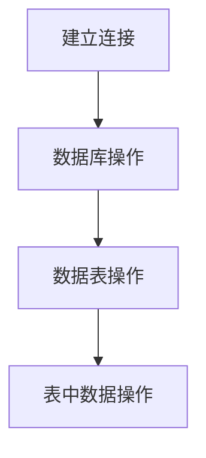
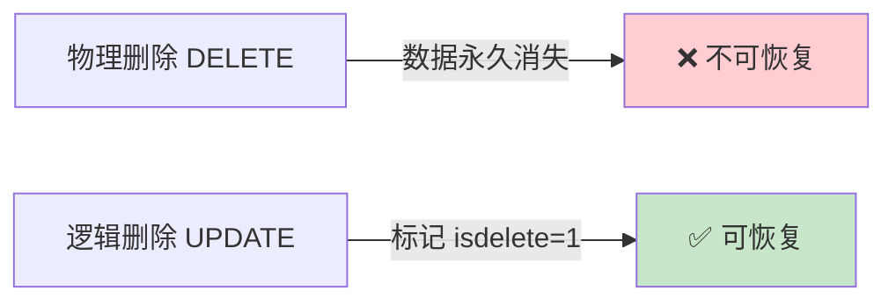

# 7.2 数据库和表操作

<div align="center">

**第七章 · MySQL 数据库 · 第 2 节**

*预计学习时间：2 小时 · 难度：⭐⭐*

</div>


---

## 📖 本节导读

建库建表是一切数据操作的起点。本节学习 **Navicat** 和 **mysql 命令行** 两种客户端，掌握数据库、表结构以及表数据的 CRUD 操作。


| 你将学会 | 核心关键词 |
|----------|-----------|
| 使用 Navicat 管理数据库 | 连接、建库、建表 |
| 命令行登录与退出 | `mysql -uroot -p` |
| 数据库 CRUD | `CREATE` `DROP` `USE` |
| 表结构与数据操作 | `ALTER` `INSERT` `UPDATE` `DELETE` |

> 📂 本章对应源码：[数据库和表的操作/](../../MySQL数据库/数据库和表的操作/)

---

## 1. Navicat 的使用

**Navicat** 是一套快速、可靠的数据库管理工具，适用于 Windows、macOS 及 Linux。

### 1.1 使用流程



| 步骤 | 操作 |
|------|------|
| 1. 建立连接 | 填写主机、端口（3306）、用户名、密码 |
| 2. 数据库操作 | 创建、删除、打开数据库 |
| 3. 数据表操作 | 设计表结构、添加/修改字段 |
| 4. 数据操作 | 增删改查表中的记录 |

> 📸 **截图位**：Navicat 新建 MySQL 连接，测试连接成功

> 💡 Navicat 以图形化方式操作数据库，适合初学者快速上手；但**命令行必须掌握**，部署到 Linux 服务器时没有图形界面。

---

## 2. 命令行客户端

### 2.1 登录与登出

```bash
mysql -uroot -p
```

| 参数 | 说明 |
|------|------|
| `-u` | 登录的用户名 |
| `-p` | 登录密码（不填写则回车后提示输入） |

**运行效果：**

```
Enter password:
Welcome to the MySQL monitor.
mysql>
```

登录成功后验证：

```sql
SELECT NOW();
```

**运行效果：**

```
+---------------------+
| NOW()               |
+---------------------+
| 2026-06-07 14:00:00 |
+---------------------+
```

**登出：**

```bash
quit    -- 或 exit 或 Ctrl+D
```

---

## 3. 数据库操作的 SQL 语句

| 操作 | SQL 语句 | 示例 |
|------|----------|------|
| 查看所有数据库 | `SHOW DATABASES;` | — |
| 创建数据库 | `CREATE DATABASE 库名 CHARSET=utf8;` | `CREATE DATABASE python41 CHARSET=utf8;` |
| 使用数据库 | `USE 库名;` | `USE python41;` |
| 查看当前数据库 | `SELECT DATABASE();` | — |
| 删除数据库 ⚠️ | `DROP DATABASE 库名;` | `DROP DATABASE test;` |
| 查看建库语句 | `SHOW CREATE DATABASE 库名;` | — |

```sql
-- 创建并切换到 python41 数据库
CREATE DATABASE python41 CHARSET=utf8;
USE python41;
SELECT DATABASE();
```

**运行效果：**

```
+------------+
| DATABASE() |
+------------+
| python41   |
+------------+
```

> 🟥 **危险警告**：`DROP DATABASE` 会永久删除数据库及其所有数据，操作前务必确认！

> 📸 **截图位**：Navicat 或命令行中 `SHOW DATABASES;` 的结果

---

## 4. 表结构操作的 SQL 语句

### 4.1 查看与创建

```sql
-- 查看当前数据库中所有表
SHOW TABLES;

-- 创建 students 表
CREATE TABLE students(
    id INT UNSIGNED PRIMARY KEY AUTO_INCREMENT NOT NULL,
    name VARCHAR(20) NOT NULL,
    age TINYINT UNSIGNED DEFAULT 0,
    height DECIMAL(5,2),
    gender ENUM('男','女','人妖','保密')
);
```

**运行效果：**

```
Query OK, 0 rows affected
```

### 4.2 常用字段类型

| 类型 | 说明 | 示例 |
|------|------|------|
| `INT` | 整数 | 年龄、编号 |
| `VARCHAR(n)` | 可变长字符串 | 姓名 |
| `DECIMAL(m,d)` | 精确小数 | 身高 175.50 |
| `ENUM` | 枚举 | 性别 |
| `DATETIME` | 日期时间 | 生日 |

### 4.3 修改表结构

| 操作 | 语法 | 示例 |
|------|------|------|
| 添加字段 | `ALTER TABLE 表名 ADD 列名 类型 约束;` | `ALTER TABLE students ADD birthday DATETIME;` |
| 修改字段类型 | `ALTER TABLE 表名 MODIFY 列名 类型 约束;` | `ALTER TABLE students MODIFY birthday DATE NOT NULL;` |
| 修改字段名和类型 | `ALTER TABLE 表名 CHANGE 原名 新名 类型 约束;` | `ALTER TABLE students CHANGE birthday birth DATE NOT NULL;` |
| 删除字段 | `ALTER TABLE 表名 DROP 列名;` | `ALTER TABLE students DROP birthday;` |

**modify vs change：**

| 关键字 | 能否改字段名 | 能否改类型/约束 |
|--------|-------------|----------------|
| `MODIFY` | ❌ | ✅ |
| `CHANGE` | ✅ | ✅ |

### 4.4 查看与删除表

```sql
SHOW CREATE TABLE students;
DROP TABLE students;
```

> ⚠️ **避坑**：`DROP TABLE` 删除整张表，比 `DELETE` 更彻底，无法恢复。

---

## 5. 表数据操作的 SQL 语句

### 5.1 查询数据

```sql
SELECT * FROM students;
SELECT id, name FROM students;
```

**运行效果：**

```
+----+--------+-----+--------+--------+
| id | name   | age | height | gender |
+----+--------+-----+--------+--------+
|  1 | 小明   |  18 | 1.75   | 男     |
+----+--------+-----+--------+--------+
```

### 5.2 添加数据

```sql
-- 全列插入（主键可用 0、default、null 占位）
INSERT INTO students VALUES(0, '小明', DEFAULT, DEFAULT, '男');

-- 部分列插入
INSERT INTO students(name, age) VALUES('王二小', 15);

-- 全列多行插入
INSERT INTO students VALUES
    (0, '张飞', 55, 1.75, '男'),
    (0, '关羽', 58, 1.85, '男');

-- 部分列多行插入
INSERT INTO students(name, height) VALUES('刘备', 1.75), ('曹操', 1.6);
```

**运行效果：**

```
Query OK, 2 rows affected
Records: 2  Duplicates: 0  Warnings: 0
```

> 💡 主键列自动增长时，全列插入需要占位，通常使用 `0`、`NULL` 或 `DEFAULT`。

### 5.3 修改与删除数据

```sql
UPDATE students SET age = 18, gender = '女' WHERE id = 6;
DELETE FROM students WHERE id = 5;
```

> ⚠️ **避坑**：`UPDATE` 和 `DELETE` 不加 `WHERE` 会修改/删除**所有行**！

### 5.4 逻辑删除

物理删除后数据不易恢复，实际项目中常用**逻辑删除**：

```sql
ALTER TABLE students ADD isdelete BIT DEFAULT 0;
UPDATE students SET isdelete = 1 WHERE id = 8;
```



---

## 6. 综合练习

请你依次完成：

1. 创建 `school` 数据库，字符集 utf8
2. 创建 `teacher` 表：`id`（主键自增）、`name`（varchar 20）、`age`（tinyint）
3. 插入 3 条记录并 `SELECT *` 查询
4. 添加 `phone` 字段，再将其删除
5. 用 Navicat 和命令行各操作一遍

> 📸 **截图位**：teacher 表中有 3 条数据的查询结果

---

## 7. 本节小结

| 分类 | 命令 |
|------|------|
| 登录 | `mysql -uroot -p` |
| 退出 | `quit` / `exit` / `Ctrl+D` |
| 创建数据库 | `CREATE DATABASE 库名 CHARSET=utf8;` |
| 使用数据库 | `USE 库名;` |
| 创建表 | `CREATE TABLE 表名(字段 类型 约束, ...);` |
| 添加字段 | `ALTER TABLE 表名 ADD 字段名 类型;` |
| 查询 | `SELECT * FROM 表名;` |
| 插入 | `INSERT INTO 表名 VALUES(...);` |
| 修改 | `UPDATE 表名 SET 列=值 WHERE 条件;` |
| 删除 | `DELETE FROM 表名 WHERE 条件;` |

---

| ← 上一节 | [第七章目录](./README.md) | 下一节 → |
|---------|--------------------------|---------|
| [7.1 MySQL 介绍](./01-MySQL介绍.md) | | [7.3 WHERE 条件查询](./03-where条件查询.md) |

*源码：[`MySQL数据库/数据库和表的操作/`](../../MySQL数据库/数据库和表的操作/)*
