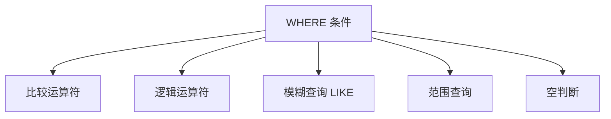

# 7.3 WHERE 条件查询

<div align="center">

**第七章 · MySQL 数据库 · 第 3 节**

*预计学习时间：2 小时 · 难度：⭐⭐*

</div>


---

## 📖 本节导读

从海量数据中精准筛选，**WHERE 是你的过滤器**。本节学习 AS 别名、DISTINCT 去重、WHERE 条件查询以及正则表达式。


| 你将学会 | 核心关键词 |
|----------|-----------|
| 给字段和表起别名 | `AS` |
| 去除重复数据 | `DISTINCT` |
| 条件筛选数据 | `WHERE` |
| 正则匹配 | `REGEXP` / `RLIKE` |

> 📂 本章对应源码：[where条件查询/](../../MySQL数据库/where条件查询/)

---

## 1. AS 关键字 —— 别名

使用 SQL 显示结果时，字段名往往可读性不好，可以用 **AS** 给字段或表起别名。

### 1.1 给字段起别名

```sql
SELECT id AS 序号, name AS 名字, gender AS 性别 FROM students;
```

**运行效果：**

```
+--------+--------+--------+
| 序号   | 名字   | 性别   |
+--------+--------+--------+
|      1 | 小明   | 男     |
+--------+--------+--------+
```

### 1.2 给表起别名

```sql
SELECT s.id, s.name, s.gender FROM students AS s;
```

> 💡 单表查询时表别名看似无意义，但在**自连接**和**多表连接**中是必需的。

---

## 2. DISTINCT 关键字 —— 去重

```sql
SELECT DISTINCT name, gender FROM students;
```

| 写法 | 效果 |
|------|------|
| `SELECT name, gender FROM students` | 返回所有行，含重复 |
| `SELECT DISTINCT name, gender FROM students` | 去除完全相同的行 |

---

## 3. WHERE 条件查询

```sql
SELECT * FROM 表名 WHERE 条件;
```

```sql
SELECT * FROM students WHERE id = 1;
```

**运行效果：**

```
+----+------+-----+--------+--------+
| id | name | age | height | gender |
+----+------+-----+--------+--------+
|  1 | 小明 |  18 | 1.75   | 男     |
+----+------+-----+--------+--------+
```



---

## 4. 比较运算符

| 运算符 | 含义 |
|--------|------|
| `=` | 等于 |
| `>` `>=` `<` `<=` | 大小比较 |
| `!=` 或 `<>` | 不等于 |

```sql
SELECT * FROM students WHERE id > 3;
SELECT * FROM students WHERE name != '黄蓉';
SELECT * FROM students WHERE isdelete = 0;
```

---

## 5. 逻辑运算符

| 运算符 | 含义 |
|--------|------|
| `AND` | 多个条件同时成立 |
| `OR` | 多个条件有一个成立 |
| `NOT` | 对条件取反 |

```sql
SELECT * FROM students WHERE id > 3 AND gender = '女';
SELECT * FROM students WHERE id < 4 OR isdelete = 0;
SELECT * FROM students WHERE NOT (age >= 10 AND age <= 15);
```

> 🟦 **技巧**：多个条件想作为一个整体，用 `()` 包裹。

---

## 6. 模糊查询 LIKE

| 通配符 | 含义 |
|--------|------|
| `%` | 任意多个任意字符 |
| `_` | 一个任意字符 |

```sql
SELECT * FROM students WHERE name LIKE '黄%';
SELECT * FROM students WHERE name LIKE '黄_';
SELECT * FROM students WHERE name LIKE '黄%' OR name LIKE '%靖';
```

**运行效果：**

```
+----+------+-----+--------+--------+
| id | name | age | height | gender |
+----+------+-----+--------+--------+
|  3 | 黄蓉 |  16 | NULL   | 女     |
+----+------+-----+--------+--------+
```

---

## 7. 范围查询

| 关键字 | 含义 |
|--------|------|
| `BETWEEN ... AND ...` | 连续范围 |
| `IN` | 非连续范围 |

```sql
SELECT * FROM students WHERE id BETWEEN 3 AND 8;
SELECT * FROM students WHERE id IN (1, 3, 5, 7);
```

---

## 8. 空判断

| 写法 | 含义 |
|------|------|
| `IS NULL` | 判断为空 |
| `IS NOT NULL` | 判断非空 |

```sql
SELECT * FROM students WHERE height IS NULL;
```

> ⚠️ **避坑**：
> - ❌ `WHERE height = NULL` — 不能判断为空
> - ❌ `WHERE height != NULL` — 不能判断非空
> - `NULL` 不等于空字符串 `''`

---

## 9. UNION ALL

`UNION ALL` 将两个查询结果合并，**不去重**：

```sql
SELECT device_id, gender, age, gpa
FROM user_profile
WHERE university = '山东大学'
UNION ALL
SELECT device_id, gender, age, gpa
FROM user_profile
WHERE gender = 'male';
```

---

## 10. 正则表达式 REGEXP

```sql
SELECT * FROM user_profile WHERE email REGEXP '\\d';
SELECT * FROM user_profile WHERE email REGEXP '^[a-zA-Z]';
```

| 模式 | 含义 |
|------|------|
| `'^example'` | 以 example 开头 |
| `'example$'` | 以 example 结尾 |
| `'a+'` | 一个或多个 a |
| `'\\d'` | 匹配数字 |

> 📸 **截图位**：Navicat 中执行 `LIKE '黄%'` 和 `REGEXP` 查询的结果对比

---

## 11. 综合练习

1. 查询所有男生的姓名和年龄，字段显示为「姓名」「年龄」
2. 查询所有不重复的年龄值
3. 查询姓名以「张」开头且年龄大于 15 的学生
4. 查询身高为空的学生记录
5. 用 REGEXP 查询 email 包含 `@gmail.com` 的记录

---

## 12. 本节小结

| 知识点 | 要点 |
|--------|------|
| `AS` | 给字段或表起别名 |
| `DISTINCT` | 去除重复行 |
| 比较/逻辑 | `=` `>` `AND` `OR` `NOT` |
| `LIKE` | `%` 多个字符，`_` 一个字符 |
| 范围 | `BETWEEN` 连续，`IN` 非连续 |
| 空判断 | `IS NULL` / `IS NOT NULL` |
| `REGEXP` | 正则匹配，比 LIKE 更强大 |

---

| ← 上一节 | [第七章目录](./README.md) | 下一节 → |
|---------|--------------------------|---------|
| [7.2 数据库和表操作](./02-数据库和表操作.md) | | [7.4 高级查询](./04-高级查询.md) |

*源码：[`MySQL数据库/where条件查询/`](../../MySQL数据库/where条件查询/)*
