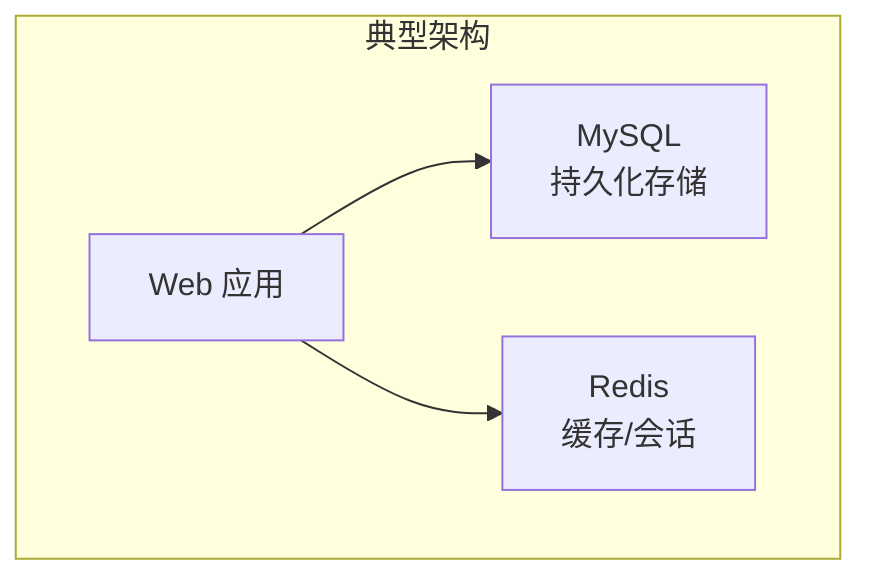

# 8.1 NoSQL 与 Redis 入门

<div align="center">

**第八章 · Redis 数据库 · 第 1 节**

*预计学习时间：1.5 小时 · 难度：⭐⭐*

</div>


---

## 📖 本节导读

MySQL 存「关系数据」，Redis 存「热点数据」。本节搞懂 NoSQL 是什么、Redis 为什么快、适合什么场景，并完成 Redis 的安装与首次连接。


| 你将学会 | 核心关键词 |
|----------|-----------|
| NoSQL 与 SQL 的区别 | Key-Value |
| Redis 的定位 | 内存数据库、缓存 |
| 启动与连接 Redis | `redis-server` `redis-cli` |
| 第一个 set/get | 字符串操作 |

> 📂 本章对应源码：[Redis数据库/](https://github.com/Drgonmancer/Leo_code/tree/main/Redis数据库)

---

## 1. NoSQL 介绍

**NoSQL**（Not Only SQL）泛指**非关系型**数据库。

| 特点 | 说明 |
|------|------|
| 不支持 SQL 语法 | 各产品有独立 API |
| 存储结构不同 | 非二维表格 |
| 数据形式 | 多为 **Key-Value** |
| 无通用语言 | 每种 NoSQL 语法各异 |

### 1.1 常见 NoSQL 产品

| 产品 | 类型 |
|------|------|
| **Redis** | 内存 KV 数据库 |
| MongoDB | 文档数据库 |
| HBase | Hadoop 分布式数据库 |
| Cassandra | 分布式数据库 |

### 1.2 NoSQL vs SQL

| 特性 | SQL 数据库 | NoSQL 数据库 |
|------|-----------|-------------|
| 适用场景 | 复杂关联查询 | 简单高频查询 |
| 事务 | 完善 | 基本不支持 |
| 性能 | 磁盘 I/O | 内存读写，极快 |
| 趋势 | 两者融合取长补短 | |



> 💡 实际项目中 MySQL + Redis **配合使用**：MySQL 存核心数据，Redis 缓存热点。

---

## 2. Redis 简介

**Redis**（Remote Dictionary Server）是用 ANSI C 编写的、支持网络的、可基于内存亦可持久化的 **Key-Value 数据库**。

| 里程碑 | 说明 |
|--------|------|
| 2010 年起 | VMware 主持开发 |
| 2013 年起 | Pivotal 赞助 |

Redis 通过多种键值数据类型适应不同场景，可胜任：

- 缓存系统
- 消息队列
- Session 共享
- 排行榜

---

## 3. Redis 核心特性

| 特性 | 说明 |
|------|------|
| **数据持久化** | 内存数据可保存到磁盘，重启后加载 |
| **丰富数据类型** | String、List、Set、Zset、Hash |
| **主从备份** | master-slave 数据备份 |
| **高性能** | 读 110,000 次/秒，写 81,000 次/秒 |
| **原子性** | 所有操作都是原子性的 |
| **特性丰富** | publish/subscribe、key 过期等 |

---

## 4. Redis 应用场景

| 场景 | 说明 |
|------|------|
| **缓存系统** | 替代 memcached，数据放内存 |
| **Session 共享** | 多台 Web 服务器共享登录状态 |
| **购物车** | Hash 存储商品和数量 |
| **排行榜** | Zset 有序集合 |
| **计数器** | String + INCR 页面访问量 |
| **消息队列** | List + LPUSH/BRPOP |

> 🟦 **技巧**：Redis 的价值在于**想象力**——理解数据结构后，很多性能问题迎刃而解。

---

## 5. 安装与启动 Redis

### 5.1 启动服务器

```bash
redis-server
redis-server --port 6379
redis-server /etc/redis/redis.conf
redis-server --daemonize yes
```

### 5.2 查看进程与端口

```bash
ps aux | grep redis
netstat -tlnp | grep 6379
```

**运行效果：**

```
redis    12345  0.1  0.5  123456  7890  ?  Ssl  10:00  0:01  redis-server *:6379
```

### 5.3 停止服务

```bash
redis-cli shutdown
redis-cli -p 6379 shutdown
sudo kill -9 <PID>
```

> 📸 **截图位**：终端执行 `redis-server` 后显示 Ready to accept connections

---

## 6. Redis 客户端连接

### 6.1 redis-cli

```bash
redis-cli
redis-cli -h 127.0.0.1 -p 6379
redis-cli ping
```

**运行效果：**

```
127.0.0.1:6379> ping
PONG
```

### 6.2 数据库切换

Redis 默认 **16 个数据库**（编号 0～15）：

```bash
select 0
select 10
dbsize
info keyspace
```

| 命令 | 作用 |
|------|------|
| `select n` | 切换到第 n 号库 |
| `dbsize` | 当前库 key 数量 |
| `flushdb` | 清空当前库 ⚠️ |
| `flushall` | 清空所有库 🟥 |

> 🟥 **危险警告**：`flushall` 会删除所有数据，生产环境绝对禁止！

---

## 7. 第一个 Redis 命令

```bash
127.0.0.1:6379> set name zhangsan
OK
127.0.0.1:6379> get name
"zhangsan"
127.0.0.1:6379> del name
(integer) 1
127.0.0.1:6379> exists name
(integer) 0
```

**运行效果说明：**

| 命令 | 返回值 | 含义 |
|------|--------|------|
| `set` | OK | 设置成功 |
| `get` | "zhangsan" | 获取值 |
| `del` | (integer) 1 | 删除了 1 个 key |
| `exists` | (integer) 0 | key 不存在 |

---

## 8. Key 的过期时间

```bash
set session:1001 "logged_in"
expire session:1001 3600
ttl session:1001
```

**运行效果：**

```
(integer) 3598
```

| 命令 | 说明 |
|------|------|
| `expire key 秒` | 设置过期时间 |
| `ttl key` | 剩余秒数（-1 永不过期，-2 不存在） |
| `persist key` | 移除过期，变为永久 |

> 💡 缓存场景必用 `expire`，避免内存被过期数据占满。

---

## 9. 综合练习

1. 启动 `redis-server`，用 `redis-cli ping` 验证
2. 执行 `set school itcast`，再 `get school`
3. 给 key 设置 60 秒过期，用 `ttl` 查看剩余时间
4. 说出 Redis 和 MySQL 各自适合什么场景
5. 查看 `info` 命令输出的 server 和 memory 部分

> 📸 **截图位**：redis-cli 中 set/get 操作的终端界面

---

## 10. 本节小结

| 类别 | 核心知识 |
|------|---------|
| NoSQL | 非关系型，KV 存储，高性能 |
| Redis | 内存 KV 数据库，多数据类型 |
| 场景 | 缓存、Session、排行榜、计数器 |
| 启动 | `redis-server` / `redis-cli` |
| 基础命令 | `set` `get` `del` `expire` `ttl` |

---

| ← 上一节 | [第八章目录](./README.md) | 下一节 → |
|---------|--------------------------|---------|
| — | | [8.2 Redis 命令与数据结构](./02-Redis命令与数据结构.md) |

*源码：[`Redis数据库/`](https://github.com/Drgonmancer/Leo_code/tree/main/Redis数据库)*
