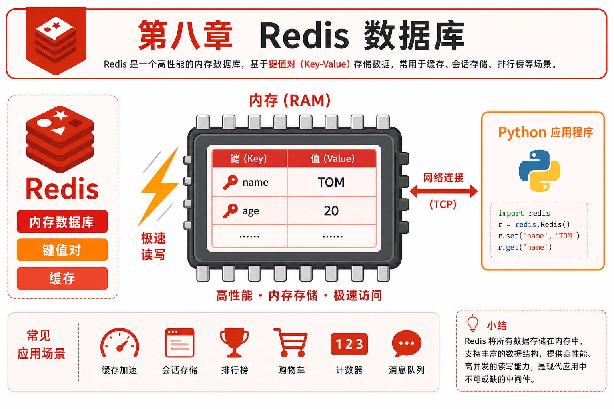
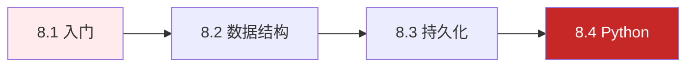

# 第八章 · Redis 数据库

> 从 NoSQL 概念到 Redis 五大数据类型，再到持久化、主从复制和 Python 编程——掌握高性能缓存的核心技能。

| 节 | 标题 | 预计时间 | 链接 |
|:--:|------|:--------:|------|
| 8.1 | NoSQL 与 Redis 入门 | 1.5h | [阅读](./01-NoSQL与Redis入门.md) |
| 8.2 | Redis 命令与数据结构 | 2.5h | [阅读](./02-Redis命令与数据结构.md) |
| 8.3 | 持久化与高可用 | 2h | [阅读](./03-持久化与高可用.md) |
| 8.4 | 与 Python 交互 | 2h | [阅读](./04-与Python交互.md) |

*源码：[`Redis数据库/`](../../Redis数据库/)*
