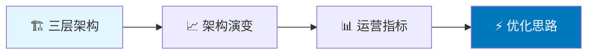
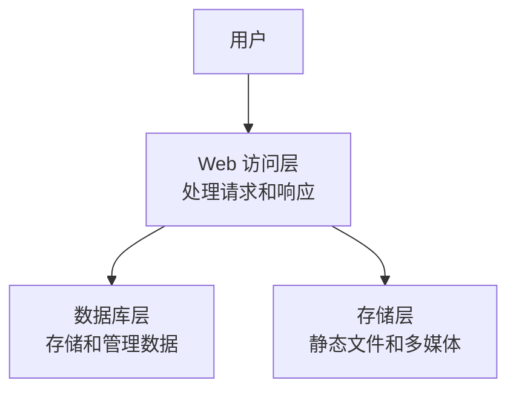
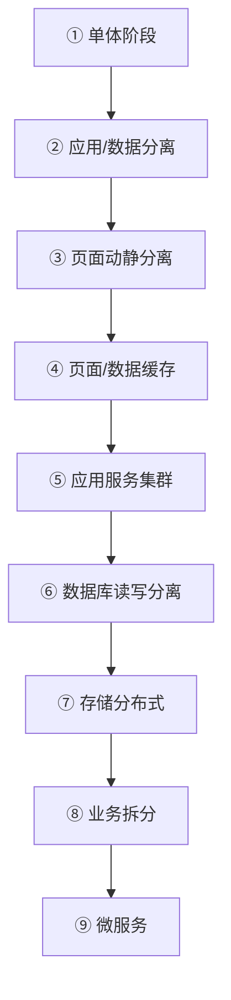
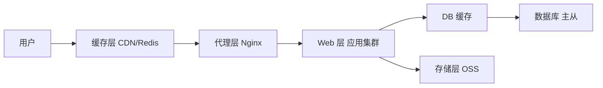
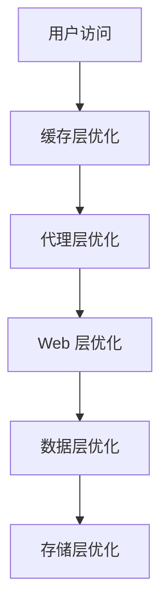

# 第 01 章 · 部署知识与架构演进

> **「一个项目至少三层：Web 访问层、数据库层、存储层——架构随用户量一起长大。」**

---

## 本章路线图

> 📎 对照原文：[`部署项目知识.md`](../../项目部署/部署项目知识.md)

---

## 1.1 项目的三层架构

任何 Web 项目至少由三层组成：

| 层级 | 职责 | 典型组件 |
|------|------|----------|
| Web 访问层 | 接收用户请求，返回响应 | Nginx、Gunicorn、Flask/Django |
| 数据库层 | 持久化业务数据 | MySQL、Redis、MongoDB |
| 存储层 | 存放静态资源 | 本地磁盘、OSS、CDN |

---

## 1.2 架构演变全流程

随着用户量增长，架构会经历以下阶段：

| 阶段 | 场景 | 部署特点 |
|------|------|----------|
| **单体** | 项目初期 | 所有服务在一台主机 |
| **应用/数据分离** | DB 有压力 | 应用和数据库分开部署 |
| **动静分离** | 页面访问有压力 | 静态资源与动态请求分离 |
| **缓存阶段** | 访问有压力 | 代理和 DB 前加缓存（Redis/CDN） |
| **应用集群** | 并发增大 | 应用服务集群 + 负载均衡 |
| **读写分离** | 数据读写有压力 | DB 主从 + 静态文件共享存储 |
| **存储分布式** | 存储有压力 | 分库分表 + 分布式存储 |
| **业务拆分** | 团队/业务复杂 | 功能模块独立部署 |
| **微服务** | 项目后期 | 所有服务自由部署，引入配置中心、消息中间件 |

> 💡 不要一开始就上微服务——**按需演进**，用户量到了再升级架构。

---

## 1.3 架构部署原则

### 一级定位：核心组成部分

Web 层 → 数据层 → 存储层，**从后向前**依次部署。

### 二级定位：功能增强部分

Web 缓存、代理、数据库缓存——**哪里压力大就部署哪里**。

---

## 1.4 网站运营指标

### 常见术语

| 术语 | 全称 | 说明 |
|------|------|------|
| **IP** | Independent IP | 一天内不同 IP 访问数，同 IP 多次访问算 1 |
| **PV** | Page View | 页面浏览量，每打开一个页面 +1 |
| **UV** | Unique Visitor | 独立访客数，同一用户多次访问算 1 |
| **VV** | Visit View | 用户访问次数，打开→浏览→关闭 = 1 次 |
| **BR** | Bounce Rate | 跳出率，未做任何操作就离开的比例 |
| **CR** | Conversion Rate | 转化率，继续浏览其他页面的比例 |

### 使用场景

| 场景 | 常用指标 | 适用人员 |
|------|----------|----------|
| 口语描述 | IP、PV、UV | 所有岗位 |
| 网站质量 | 跳出率、转化率 | 产品、研发 |

### 分析工具

- **服务器日志**：Nginx / Apache access.log
- **内部监控**：Prometheus + Grafana
- **互联网工具**：百度统计、Google Analytics

---

## 1.5 网站优化思路

当用户访问量变化时，各层的优化策略：

### 缓存层

| 问题 | 解决思路 |
|------|----------|
| 如何用最小代价抗住大量访问？ | 自建 Web 缓存或购买 CDN；缓存更新频率低的资源；做好防爬安全措施 |

### 代理层（Nginx）

| 问题 | 解决思路 |
|------|----------|
| 如何提高请求分发质量？ | 按关键字分流、IP 封禁、读写分离、路径精确分流 |
| upstream/location 规则过多导致 404？ | upstream 按功能拆分；location 用 `^~` 锚定 |

### Web 层

| 问题 | 解决思路 |
|------|----------|
| 动态请求过多 | 请求量大 → Web 缓存/CDN 或集群；DB 操作多 → 页面静态化 |
| 静态资源访问慢 | 设置合理缓存过期时间，推送到前端缓存 |

### 数据层

| 问题 | 解决思路 |
|------|----------|
| 读取频繁 | 前端缓存、分布式缓存、优化查询 |
| 写入频繁 | 读写分离、分库分表 |
| 开发角度 | 合理索引、尽量条件查询 |

### 存储层

| 问题 | 解决思路 |
|------|----------|
| 数据存储质量 | 高质量存储设备、分布式存储、备份策略 |

---

## 本章小结

| 要点 | 一句话 |
|------|--------|
| 三层架构 | Web + DB + 存储 |
| 架构演变 | 单体 → 分离 → 缓存 → 集群 → 微服务 |
| 部署原则 | 核心从后向前，增强按需部署 |
| 运营指标 | IP/PV/UV 看流量，BR/CR 看质量 |

---

## 动手练习

1. 画出你当前项目的三层架构图，标注各层使用的技术
2. 假设日 PV 从 1 万涨到 100 万，你会优先优化哪一层？
3. 用 `tail -f /var/log/nginx/access.log` 观察一次真实访问的日志格式

---

*下一章：[02-部署环境与流程](./02-部署环境与流程.md)*
