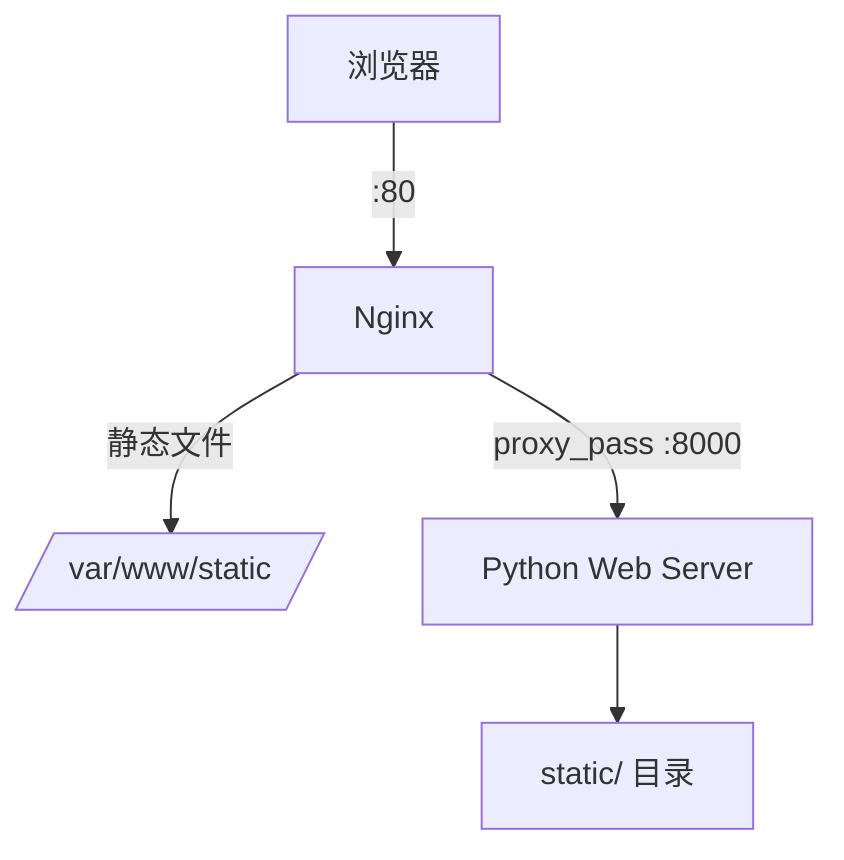

# 第 03 章 · Nginx 部署配置

> **「Nginx 是 Web 世界的交通警察——分发请求、缓存静态资源、守护 HTTPS。」**

---

## 本章路线图


> 📎 完整版请参阅：[`Nginx 部署配置.md`](https://github.com/Drgonmancer/Leo_code/blob/main/nginx/Nginx%20部署配置.md)（含负载均衡、性能优化、安全加固）

---

## 3.1 Nginx 简介

**Nginx**（engine x）是高性能的 HTTP 和反向代理服务器。

| 特点 | 说明 |
|------|------|
| 高并发 | 异步非阻塞模型 |
| 低内存 | 内存消耗低，并发能力强 |
| 稳定性 | 运行稳定，配置灵活 |
| 热部署 | 不重启即可更新配置 |

---

## 3.2 安装 Nginx

### Ubuntu / Debian

```bash
sudo apt update
sudo apt install nginx
sudo systemctl start nginx
sudo systemctl enable nginx
sudo systemctl status nginx
```

### CentOS / RHEL

```bash
sudo yum install epel-release
sudo yum install nginx
sudo systemctl start nginx
sudo systemctl enable nginx
```

### Windows

```powershell
winget install Nginx.Nginx
# 或从 nginx.org 下载解压后：
cd C:\nginx-1.24.0
start nginx
nginx -s reload    # 重载配置
nginx -s stop      # 停止
```

安装成功后，浏览器访问 `http://127.0.0.1` 应看到 Nginx 欢迎页。

---

## 3.3 核心目录结构

| 路径 | 说明 |
|------|------|
| `/etc/nginx/nginx.conf` | 主配置文件 |
| `/etc/nginx/conf.d/` | 扩展配置目录 |
| `/etc/nginx/sites-available/` | 可用站点配置 |
| `/etc/nginx/sites-enabled/` | 已启用站点（软链接） |
| `/var/log/nginx/access.log` | 访问日志 |
| `/var/log/nginx/error.log` | 错误日志 |
| `/var/www/html/` | 默认网站根目录 |

---

## 3.4 基础配置

### 主配置文件结构

```nginx
# /etc/nginx/nginx.conf

user www-data;
worker_processes auto;       # 自动检测 CPU 核心数

events {
    worker_connections 1024;   # 每个 worker 最大连接数
}

http {
    include       /etc/nginx/mime.types;
    default_type  application/octet-stream;

    sendfile on;
    keepalive_timeout 65;

    gzip on;                   # 开启 Gzip 压缩

    include /etc/nginx/conf.d/*.conf;
    include /etc/nginx/sites-enabled/*;
}
```

### Location 匹配优先级

| 优先级 | 语法 | 说明 |
|:------:|------|------|
| 1 | `= /path` | 精确匹配 |
| 2 | `^~ /path` | 前缀匹配，停止正则 |
| 3 | `~ /path` | 正则匹配（区分大小写） |
| 4 | `~* /path` | 正则匹配（不区分大小写） |
| 5 | `/path` | 普通前缀匹配（最长优先） |

---

## 3.5 部署静态网站

### 步骤一：创建站点目录

```bash
sudo mkdir -p /var/www/mywebsite
echo "Hello Nginx" | sudo tee /var/www/mywebsite/index.html
sudo chown -R www-data:www-data /var/www/mywebsite
sudo chmod -R 755 /var/www/mywebsite
```

### 步骤二：创建配置文件

```nginx
# /etc/nginx/conf.d/mywebsite.conf

server {
    listen 80;
    server_name mywebsite.com www.mywebsite.com;

    root /var/www/mywebsite;
    index index.html index.htm;

    location / {
        try_files $uri $uri/ =404;
    }

    # 静态资源缓存 30 天
    location ~* \.(jpg|jpeg|png|gif|ico|css|js)$ {
        expires 30d;
        add_header Cache-Control "public, no-transform";
    }
}
```

### 步骤三：测试并重载

```bash
sudo nginx -t          # 测试语法
sudo systemctl reload nginx
curl http://localhost  # 验证
```


---

## 3.6 反向代理

将请求转发给后端 Python 应用（Gunicorn / uWSGI）：

```nginx
server {
    listen 80;
    server_name api.example.com;

    location / {
        proxy_pass http://127.0.0.1:8000;

        proxy_set_header Host $host;
        proxy_set_header X-Real-IP $remote_addr;
        proxy_set_header X-Forwarded-For $proxy_add_x_forwarded_for;
        proxy_set_header X-Forwarded-Proto $scheme;

        proxy_connect_timeout 60s;
        proxy_read_timeout 60s;
    }
}
```


### 负载均衡

```nginx
upstream backend {
    server 192.168.1.10:8080 weight=5;
    server 192.168.1.11:8080 weight=5;
    server 192.168.1.12:8080 backup;
}

server {
    listen 80;
    server_name myapp.example.com;

    location / {
        proxy_pass http://backend;
        proxy_set_header Host $host;
        proxy_set_header X-Real-IP $remote_addr;
    }
}
```

| 策略 | 配置 | 适用 |
|------|------|------|
| 轮询 | 默认 | 服务器性能相近 |
| 加权轮询 | `weight=N` | 性能不同 |
| 最少连接 | `least_conn` | 长连接场景 |
| IP 哈希 | `ip_hash` | 需要 Session 保持 |

---

## 3.7 配置 HTTPS

### 使用 Let's Encrypt 免费证书

```bash
sudo apt install certbot python3-certbot-nginx
sudo certbot --nginx -d example.com -d www.example.com
sudo certbot renew --dry-run   # 测试自动续期
```

### SSL 配置模板

```nginx
server {
    listen 80;
    server_name example.com;
    return 301 https://$server_name$request_uri;   # HTTP → HTTPS
}

server {
    listen 443 ssl http2;
    server_name example.com;

    ssl_certificate     /etc/letsencrypt/live/example.com/fullchain.pem;
    ssl_certificate_key /etc/letsencrypt/live/example.com/privkey.pem;

    ssl_protocols TLSv1.2 TLSv1.3;
    add_header Strict-Transport-Security "max-age=63072000" always;

    root /var/www/html;
    location / {
        try_files $uri $uri/ =404;
    }
}
```

---

## 3.8 常用命令

| 命令 | 说明 |
|------|------|
| `sudo nginx -t` | 测试配置语法 |
| `sudo systemctl reload nginx` | 重载配置（不断连接） |
| `sudo systemctl restart nginx` | 重启服务 |
| `sudo systemctl status nginx` | 查看状态 |
| `sudo tail -f /var/log/nginx/access.log` | 实时访问日志 |
| `sudo tail -f /var/log/nginx/error.log` | 实时错误日志 |

---

## 3.9 常见问题排查

| 问题 | 原因 | 解决方案 |
|------|------|----------|
| 403 Forbidden | 权限不足或 index 不存在 | 检查 `chown` 和 `index` 指令 |
| 404 Not Found | root 路径错误 | 确认 `root` 配置 |
| 502 Bad Gateway | 后端未运行 | 检查 Gunicorn/uWSGI 状态 |
| 504 Gateway Timeout | 代理超时 | 增大 `proxy_read_timeout` |
| 413 Entity Too Large | 上传文件过大 | 调整 `client_max_body_size` |

### 快速检查清单

- [ ] Nginx 已启动：`systemctl status nginx`
- [ ] 配置语法正确：`nginx -t`
- [ ] 目录权限正确：`chown -R www-data:www-data`
- [ ] 防火墙已开放：`ufw allow 80/tcp`
- [ ] 本地能访问：`curl http://localhost`
- [ ] 错误日志无异常：`tail error.log`

---

## 3.10 完整部署示例

将第 04 部分手写的 Python 静态 Web 服务器 + Nginx 反向代理：



**Nginx 配置**：

```nginx
server {
    listen 80;
    server_name localhost;

    # 静态资源直接由 Nginx 提供（更快）
    location /static/ {
        alias /var/www/myapp/static/;
        expires 7d;
    }

    # 动态请求转发给 Python
    location / {
        proxy_pass http://127.0.0.1:8000;
        proxy_set_header Host $host;
    }
}
```

---

## 本章小结

| 能力 | 关键配置 |
|------|----------|
| 静态网站 | `root` + `try_files` |
| 反向代理 | `proxy_pass` + 请求头 |
| 负载均衡 | `upstream` + 策略 |
| HTTPS | Let's Encrypt + SSL 配置 |
| 排查问题 | `nginx -t` + 日志分析 |

---

## 动手练习

1. 在本机安装 Nginx，部署一个含 CSS/JS 的静态网站
2. 用 Nginx 反向代理到 `python -m http.server 8000`
3. 配置静态资源 30 天缓存，用 F12 观察 `Cache-Control` 响应头
4. 阅读 [`Nginx 部署配置.md`](https://github.com/Drgonmancer/Leo_code/blob/main/nginx/Nginx%20部署配置.md) 中的性能优化和安全加固章节

---

*上一章：[02-部署环境与流程](./02-部署环境与流程.md) · 返回：[README](./README.md)*
