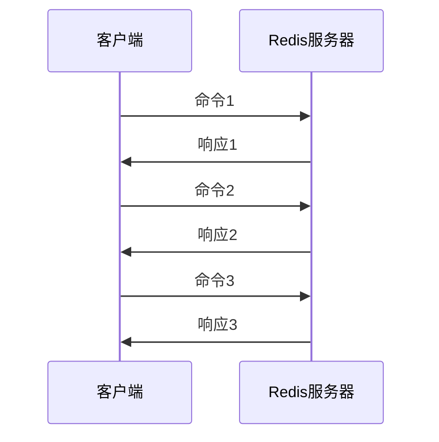
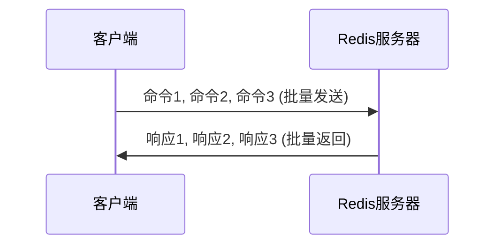
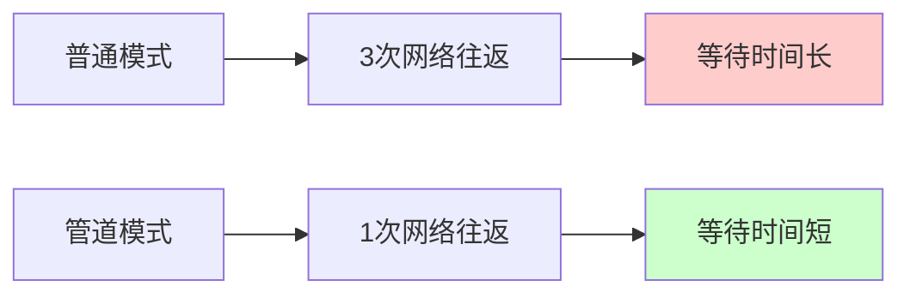
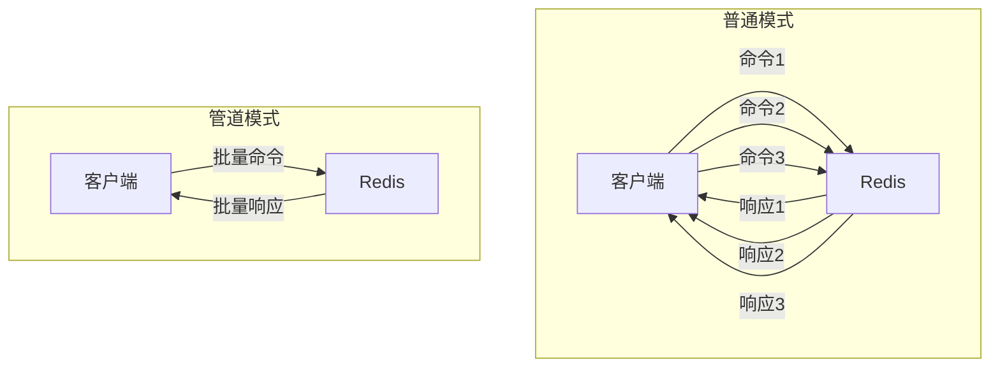

# Redis 完整命令手册

---

## 一、Redis 简介

Redis（Remote Dictionary Server）是一个开源的、基于内存的数据结构存储系统，常用作数据库、缓存和消息队列。

**特点：**
- 内存存储，读取速度快
- 支持多种数据结构
- 支持持久化
- 支持集群和主从复制

---

## 二、服务器端命令

### 1. 启动 Redis 服务器

```bash
# 默认端口启动
redis-server

# 指定端口启动
redis-server --port 6379

# 指定配置文件启动
redis-server /etc/redis/redis.conf

# 后台启动
redis-server --daemonize yes
```

### 2. 查看帮助

```bash
redis-server --help
```

### 3. 常用操作

```bash
# 查看 Redis 服务器进程
ps aux | grep redis

# 查看 Redis 端口
netstat -tlnp | grep 6379

# 杀死 Redis 服务器
sudo kill -9 <进程PID>

# 停止 Redis 服务器
redis-cli shutdown

# 或者指定端口关闭
redis-cli -p 6379 shutdown
```

---

## 三、客户端命令

### 1. 连接 Redis

```bash
# 本机默认端口连接
redis-cli

# 指定主机和端口连接
redis-cli -h 127.0.0.1 -p 6379

# 连接后选择数据库
redis-cli -n <数据库编号>
```

### 2. 测试连接

```bash
# ping 命令测试连接
redis-cli ping
# 返回 PONG 表示连接成功
```

### 3. 查看帮助

```bash
redis-cli --help
```

---

## 四、数据库操作

### 1. 切换数据库

```bash
# Redis 默认有 16 个数据库（0-15）
select <数据库编号>
# 例如：select 0 或 select 10
```

### 2. 查看数据库信息

```bash
# 查看所有 key 的数量
dbsize

# 查看数据库信息
info

# 查看当前数据库的 key 数量
info keyspace
```

### 3. 清空数据库

```bash
# 清空当前数据库
flushdb

# 清空所有数据库
flushall
```

---

## 五、键（Key）操作

### 1. 基本键操作

```bash
# 设置键值
set <key> <value>
# 例如：set name zhangsan

# 获取值
get <key>
# 例如：get name

# 删除键
del <key> [key ...]
# 例如：del name age

# 检查键是否存在
exists <key>
# 返回 1 表示存在，0 表示不存在
```

### 2. 键的过期时间

```bash
# 设置键的过期时间（秒）
expire <key> <秒数>

# 设置键的过期时间（毫秒）
pexpire <key> <毫秒数>

# 查看键的剩余过期时间（秒）
ttl <key>
# 返回 -1 表示永不过期，-2 表示不存在

# 查看键的剩余过期时间（毫秒）
pttl <key>

# 移除键的过期时间（永不过期）
persist <key>
```

### 3. 键的其他操作

```bash
# 重命名键
rename <old_key> <new_key>

# 仅当新键不存在时重命名
renamenx <old_key> <new_key>

# 查看键的数据类型
type <key>

# 查找匹配的键
keys <pattern>
# 例如：keys * 表示查看所有键
# 例如：keys user* 表示查看以 user 开头的键

# 随机返回一个键
randomkey

# 移动键到其他数据库
move <key> <数据库编号>
```

---

## 六、字符串（String）类型

### 数据类型说明

**string类型**是Redis中最为基础的数据存储类型，它在Redis中是二进制安全的，这便意味着该类型可以接受任何格式的数据，如JPEG图像数据或Json对象描述信息等，在Redis中字符串类型的Value最多可以容纳的数据长度是512M。

字符串类型常用于：
- 缓存数据
- 计数器（如访问次数）
- 分布式锁
- 存储会话信息

### 1. 基本操作

```bash
# 设置值
set <key> <value>

# 获取值
get <key>

# 同时设置多个键值对
mset <key1> <value1> <key2> <value2> ...
# 例如：mset name zhangsan age 20

# 同时获取多个值
mget <key1> <key2> ...
# 例如：mget name age

# 获取字符串长度
strlen <key>
```

### 2. 数值操作

```bash
# 自增 1（键不存在时自动创建）
incr <key>

# 自增指定数值
incrby <key> <增量>

# 自增浮点数
incrbyfloat <key> <增量>

# 自减 1
decr <key>

# 自减指定数值
decrby <key> <减量>
```

### 3. 字符串追加和切片

```bash
# 追加字符串
append <key> <要追加的内容>

# 获取子字符串（索引从 0 开始）
getrange <key> <start> <end>
# 例如：getrange str 0 3

# 替换子字符串
setrange <key> <offset> <value>
```

### 4. 高级操作

```bash
# 设置值并返回旧值
getset <key> <new_value>

# 设置值（仅当键不存在）
setnx <key> <value>

# 设置值（仅当键存在）
setxx <key> <value>

# 设置值并设置过期时间
setex <key> <过期秒数> <value>

# 设置值并设置过期时间（毫秒）
psetex <key> <过期毫秒数> <value>
```

---

## 七、哈希（Hash）类型

### 数据类型说明

**hash类型**是Redis中用来存储对象的数据类型，它可以看做是Map<String, Object>类型的结构。hash类型非常适合存储对象类数据，相较于把对象序列化后存储为字符串类型，hash类型会让对象的访问更加灵活。

hash类型常用于：
- 存储用户信息（如用户ID、用户名、年龄等）
- 存储配置信息
- 存储商品信息

### 1. 基本操作

```bash
# 设置哈希中的字段值
hset <key> <field> <value>
# 例如：hset user:1 name zhangsan

# 获取哈希中的字段值
hget <key> <field>

# 同时设置多个字段
hmset <key> <field1> <value1> <field2> <value2> ...

# 同时获取多个字段
hmget <key> <field1> <field2> ...

# 获取哈希中所有字段和值
hgetall <key>

# 获取哈希中所有字段
hkeys <key>

# 获取哈希中所有值
hvals <key>

# 获取哈希中字段的数量
hlen <key>
```

### 2. 其他操作

```bash
# 检查字段是否存在
hexists <key> <field>

# 删除哈希中的字段
hdel <key> <field> [field ...]

# 字段值自增
hincrby <key> <field> <增量>

# 字段值自增浮点数
hincrbyfloat <key> <field> <增量>

# 随机获取一个字段
hrandfield <key> [count]
```

---

## 八、列表（List）类型

### 数据类型说明

**list类型**是一个双向链表结构，主要功能是push（入栈）、pop（出栈）、获取元素等。list类型本质上是字符串数组，按插入顺序排序，可以添加元素到头部或尾部。

list类型常用于：
- 消息队列
- 最新消息列表
- 任务队列
- 栈结构（后进先出）

### 1. 基本操作

```bash
# 从左侧添加元素
lpush   [value ...]
# 例子：lpush mylist a b c

# 从右侧添加元素
rpush   [value ...]
# 例子：rpush mylist a b c

# 获取列表指定范围的元素
lrange   
# 例子：lrange mylist 0 -1

# 获取列表指定索引的元素
lindex  
# 例子：lindex mylist 0

# 获取列表长度
llen 
# 例子：llen mylist
```

### 2. 元素操作

```bash
# 从左侧移除并返回第一个元素
lpop 
# 例子：lpop mylist

# 从右侧移除并返回最后一个元素
rpop 
# 例子：rpop mylist

# 移除列表中指定数量的指定元素
lrem   
# 例子：lrem mylist 2 a

# 设置列表指定索引的元素值
lset   
# 例子：lset mylist 0 "new"

# 在指定元素前或后插入新元素
linsert  BEFORE|AFTER  
# 例子：linsert mylist BEFORE "b" "x"

# 截取列表（保留指定范围）
ltrim   
# 例子：ltrim mylist 0 2
```

### 3. 阻塞操作

```bash
# 阻塞从左侧获取元素
blpop  [key ...] 
# 例子：blpop mylist 0

# 阻塞从右侧获取元素
brpop  [key ...] 
# 例子：brpop mylist 10
```

---

## 九、集合（Set）类型

### 数据类型说明

**set类型**是string类型的无序集合，集合中的成员是唯一的，不能出现重复的数据。Redis中的set和数学中的集合概念一样，可以进行交集、并集、差集等操作。

set类型常用于：
- 标签系统（如用户标签）
- 共同关注/好友推荐
- 去重（防止重复投票、重复访问）
- 抽奖活动（随机选取）

### 1. 基本操作

```bash
# 添加元素到集合
sadd <key> <member> [member ...]

# 获取集合所有元素
smembers <key>

# 获取集合元素数量
scard <key>

# 判断元素是否在集合中
sismember <key> <member>
```

### 2. 集合运算

```bash
# 返回多个集合的交集
sinter <key> [key ...]

# 返回多个集合的并集
sunion <key> [key ...]

# 返回多个集合的差集
sdiff <key> [key ...]

# 将交集结果保存到目标集合
sinterstore <destination> <key> [key ...]

# 将并集结果保存到目标集合
sunionstore <destination> <key> [key ...]

# 将差集结果保存到目标集合
sdiffstore <destination> <key> [key ...]
```

### 3. 其他操作

```bash
# 随机获取一个或多个元素
srandmember <key> [count]

# 随机移除并返回一个元素
spop <key> [count]

# 移除集合中指定的元素
srem <key> <member> [member ...]

# 将元素从一个集合移动到另一个集合
smove <source> <destination> <member>
```

---

## 十、有序集合（Sorted Set）类型

### 数据类型说明

**sorted set类型**（zset）是string类型的有序集合。sorted set中的每个成员都会关联一个分数（score），Redis通过这个分数来为集合中的成员进行从小到大的排序。sorted set的成员是唯一的，但分数可以重复。

sorted set类型常用于：
- 排行榜（如游戏排行榜、销售排行榜）
- 延时队列
- 权重任务队列
- 按时间排序的消息

### 1. 基本操作

```bash
# 添加成员（带分数）
zadd <key> <score> <member> [score member ...]

# 获取成员分数
zscore <key> <member>

# 获取成员排名（从小到大，0 开始）
zrank <key> <member>

# 获取成员排名（从大到小）
zrevrank <key> <member>

# 获取指定分数范围的成员数量
zcount <key> <min> <max>

# 获取集合元素数量
zcard <key>
```

### 2. 范围查询

```bash
# 按分数升序获取指定范围的成员
zrange <key> <start> <end> [WITHSCORES]

# 按分数降序获取指定范围的成员
zrevrange <key> <start> <end> [WITHSCORES]

# 按分数范围获取成员
zrangebyscore <key> <min> <max> [WITHSCORES] [LIMIT offset count]

# 按分数范围获取成员（降序）
zrevrangebyscore <key> <max> <min> [WITHSCORES] [LIMIT offset count]
```

### 3. 其他操作

```bash
# 增加成员分数
zincrby <key> <increment> <member>

# 移除指定成员
zrem <key> <member> [member ...]

# 移除指定排名范围的成员
zremrangebyrank <key> <start> <end>

# 移除指定分数范围的成员
zremrangebyscore <key> <min> <max>

# 交集并保存结果
zinterstore <destination> <numkeys> <key> [key ...] [WEIGHTS weight] [AGGREGATE SUM|MIN|MAX]

# 并集并保存结果
zunionstore <destination> <numkeys> <key> [key ...] [WEIGHTS weight] [AGGREGATE SUM|MIN|MAX]
```

---

## 十一、事务操作

### 基本概念

Redis 事务是一组命令的集合，事务中的所有命令都会被序列化并按顺序执行。Redis 事务具有以下特性：

| 特性 | 说明 |
|------|------|
| 原子性 | 事务中的命令要么全部执行，要么全部不执行 |
| 顺序性 | 命令按照入队顺序依次执行 |
| 隔离性 | 事务执行期间不会被其他客户端命令干扰 |
| 不支持回滚 | 与关系型数据库不同，Redis 事务不提供回滚功能 |

### 常用命令

```bash
# 开始事务
# 将后续命令放入事务队列中，而不立即执行
multi

# 执行事务
# 一次性执行事务队列中的所有命令
exec

# 取消事务
# 清除事务队列中的所有命令，结束事务
discard

# 监视键（乐观锁）
# 在事务执行前监视一个或多个键，如果这些键被其他客户端修改，事务将自动失败
watch <key> [key ...]

# 取消监视
# 取消所有键的监视
unwatch
```

### 使用示例

#### 基本事务

```bash
# 客户端1
127.0.0.1:6379> multi
OK
127.0.0.1:6379> set key1 "value1"
QUEUED
127.0.0.1:6379> set key2 "value2"
QUEUED
127.0.0.1:6379> exec
1) OK
2) OK
```

#### 使用 WATCH 实现乐观锁

```bash
# 客户端1 - 监视 balance 键
127.0.0.1:6379> watch balance
OK
127.0.0.1:6379> multi
OK
127.0.0.1:6379> set balance 100
QUEUED

# 客户端2 - 在客户端1执行事务前修改了 balance
127.0.0.1:6379> set balance 50
OK

# 客户端1 - 执行事务，此时 balance 已被修改，事务失败
127.0.0.1:6379> exec
(nil)  # 事务执行失败，返回 nil
```

#### 取消事务

```bash
127.0.0.1:6379> multi
OK
127.0.0.1:6379> set key1 "value1"
QUEUED
127.0.0.1:6379> discard
OK
127.0.0.1:6379> get key1
(nil)  # 事务已取消，key1 不存在
```

### 管道（Pipeline）

#### 什么是管道

管道是 Redis的一种重要性能优化技术，它允许客户端将多个命令一次性发送给服务器，而不需要等待每个命令的响应。这样可以显著减少网络往返次数（RTT），提高批量操作的性能。

#### 工作原理

**普通模式（3次往返）：**



**管道模式（1次往返）：**



---

### 性能对比图



---

### 完整流程对比



---

#### Redis 管道命令

```bash
# 管道命令本身不是Redis命令，而是客户端的功能
# 以下是演示管道效果的示例

# 方式1：使用原生 redis-cli 的管道
echo -e "set key1 val1\nset key2 val2\nset key3 val3\nget key1\nget key2\nget key3" | redis-cli --pipe

# 方式2：查看管道统计信息
redis-cli --pipe-stat
```

#### 管道与事务的区别

| 特性 | 事务 | 管道 |
|------|------|------|
| 命令执行 | 原子性执行 | 批量执行（非原子） |
| 往返次数 | 1次往返 | 1次往返 |
| 支持回滚 | 不支持 | 不支持 |
| 使用场景 | 需要原子性的操作 | 减少网络开销 |
| 错误处理 | 命令错误会导致整个事务失败 | 每个命令独立，错误不影响其他命令 |
| 客户端支持 | 大多数客户端原生支持 | 需要客户端显式使用管道功能 |


### 注意事项

1. **EXEC 执行前**：如果执行 `MULTI` 后没有执行 `EXEC` 或 `DISCARD`，连接会保持阻塞状态
2. **WATCH 监视**：在事务执行失败后，需要重新执行 `WATCH` 来监视键
3. **错误处理**：事务中的语法错误会导致整个事务执行失败
4. **管道大小**：不要一次发送过多命令，建议分批处理（1000-5000条/批）
5. **内存考虑**：管道中的命令会占用客户端和服务端的内存，大批量操作时要注意内存使用

---
## 十二、发布/订阅

### 数据类型说明

**发布/订阅**（pub/sub）是一种消息通信模式，发布者（publisher）发送消息，订阅者（subscriber）接收消息。Redis的pub/sub支持发布/订阅模式、模式订阅等。

pub/sub常用于：
- 实时消息推送
- 聊天室
- 事件通知
- 缓存失效通知

### 1. 发布

```bash
# 发布消息
publish <channel> <message>
```

### 2. 订阅

```bash
# 订阅频道
subscribe <channel> [channel ...]

# 订阅模式
psubscribe <pattern> [pattern ...]

# 退订频道
unsubscribe [channel ...]

# 退订模式
punsubscribe [pattern ...]
```

---

## 十三、HyperLogLog 类型

### 数据类型说明

**HyperLogLog**是一种用于基数统计的数据结构，能够使用极少的内存来统计巨量数据。HyperLogLog 的统计是有一定误差的，标准误差为 0.81%，但这在大多数场景下是可以接受的。

HyperLogLog常用于：
- 统计网站独立访客（UV）
- 统计每日活跃用户
- 统计搜索词数量

### 常用命令

```bash
# 添加元素
pfadd <key> <element> [element ...]

# 统计基数（元素数量）
pfcount <key> [key ...]

# 合并多个 HyperLogLog
pfmerge <destkey> <sourcekey> [sourcekey ...]
```

---

## 十四、Bitmap 类型

### 数据类型说明

**Bitmap**不是一种实际的数据类型，而是string类型上的一组位操作命令。Bitmap本质上是二进制位数组，可以用于高效地存储大量开关状态或布尔值。

Bitmap常用于：
- 用户签到记录
- 用户活跃度统计
- 布隆过滤器（底层实现）
- 统计每日活跃用户

### 1. 基本操作

```bash
# 设置位
setbit <key> <offset> <value>

# 获取位
getbit <key> <offset>

# 统计位为 1 的数量
bitcount <key> [start end]
```

### 2. 位运算

```bash
# 位 AND 运算
bitand <destkey> <key> [key ...]

# 位 OR 运算
bitor <destkey> <key> [key ...]

# 位 XOR 运算
bitxor <destkey> <key> [key ...]

# 获取第一个位为 1 的位置
bitpos <key> <bit> [start] [end]
```

---

## 十五、过期时间操作汇总

### 数据类型说明

Redis支持为key设置过期时间（TTL，Time To Live），当key过期后会自动被删除。过期时间可以设置为秒或毫秒级别，也可以设置具体的时间戳。

### 常用命令

```bash
# 设置键的过期时间（秒）
expire <key> <seconds>

# 设置键的过期时间（毫秒）
pexpire <key> <milliseconds>

# 设置过期时间点（时间戳秒）
expireat <key> <timestamp>

# 设置过期时间点（时间戳毫秒）
pexpireat <key> <milliseconds>

# 查看剩余过期时间（秒）
ttl <key>

# 查看剩余过期时间（毫秒）
pttl <key>

# 移除过期时间（永不过期）
persist <key>
```

---

## 十六、连接命令

### 常用命令

```bash
# 测试连接
ping

# 切换数据库
select <index>

# 查看服务器信息
info [section]

# 查看所有键
keys *

# 清空当前数据库
flushdb

# 清空所有数据库
flushall

# 退出连接
quit

# 关闭连接
shutdown [NOSAVE|SAVE]
```

---

## 十七、慢查询日志

### 数据类型说明

Redis慢查询日志用于记录执行时间超过指定阈值的命令，可以帮助我们发现性能问题。Redis通过`slowlog`命令来管理慢查询日志。

### 常用命令

```bash
# 获取慢查询日志
slowlog get [count]

# 获取慢查询日志数量
slowlog len

# 清空慢查询日志
slowlog reset
```

---

## 十八、内存相关

### 数据类型说明

Redis提供了丰富的内存管理命令，可以查看内存使用情况、进行内存优化等。

### 常用命令

```bash
# 查看内存使用情况
memory usage <key>

# 查看内存统计信息
memory stats

# 内存优化建议
memory doctor
```

---

## 十九、备份与恢复

### 数据类型说明

Redis支持两种持久化方式：RDB（快照）和AOF（追加文件）。RDB是定期生成数据快照，AOF是记录每次写操作。

### 1. 手动备份

```bash
# 同步保存数据到磁盘
save

# 后台异步保存数据
bgsave

# 上一次成功保存的时间
lastsave
```

### 2. 恢复数据

```bash
# 关闭 Redis 后，将备份文件（dump.rdb）复制到 Redis 数据目录
# 重新启动 Redis 即可恢复数据
```

---

## 常用配置项速查

| 配置项 | 说明 | 默认值 |
|--------|------|--------|
| port | 端口号 | 6379 |
| bind | 绑定地址 | 127.0.0.1 |
| timeout | 客户端空闲超时（秒） | 0 |
| maxclients | 最大客户端连接数 | 10000 |
| maxmemory | 最大内存 | 0（无限制） |
| maxmemory-policy | 内存淘汰策略 | noeviction |
| databases | 数据库数量 | 16 |
| rdbcompression | RDB 压缩 | yes |
| dbfilename | RDB 文件名 | dump.rdb |
| dir | 数据目录 | ./ |

---

## 附录：命令语法说明

- 方括号 `[ ]` 表示可选参数
- 尖括号 `< >` 表示必填参数
- `|` 表示选择（多选一）
- `...` 表示可以重复多个

---

> 💡 提示：更多详细命令和用法请参考 Redis 官方文档：https://redis.io/commands
