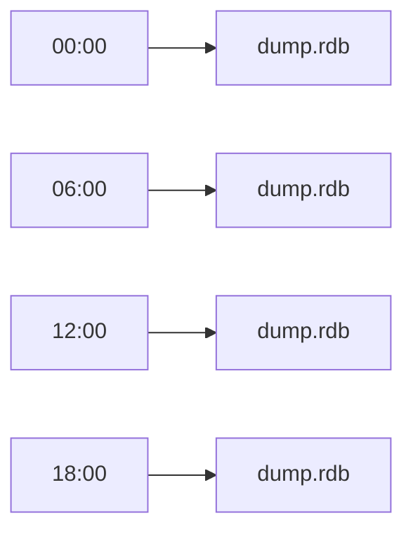
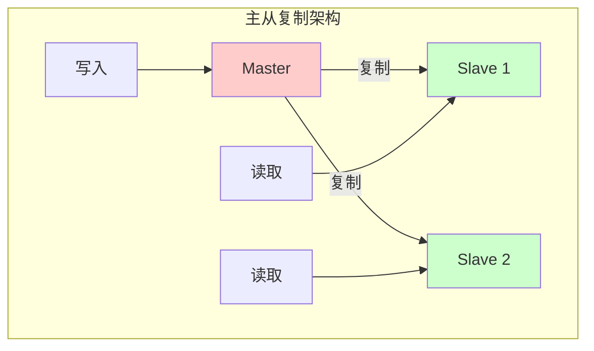
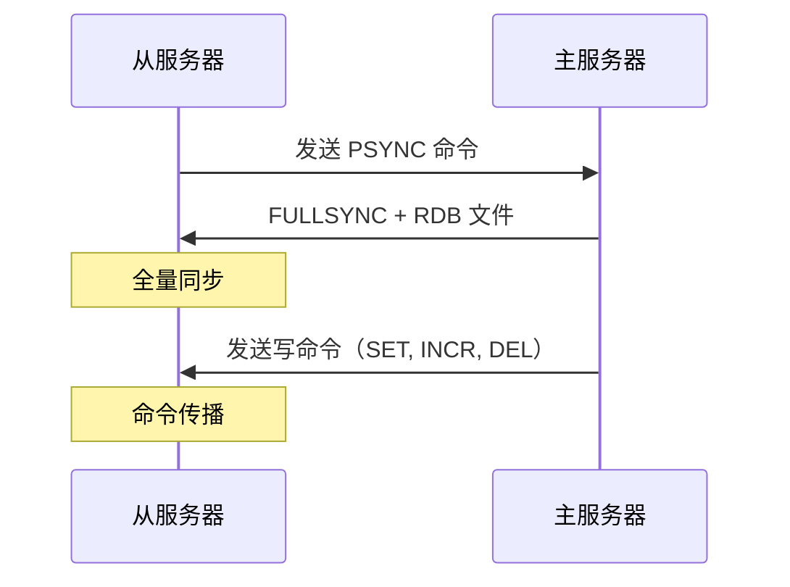
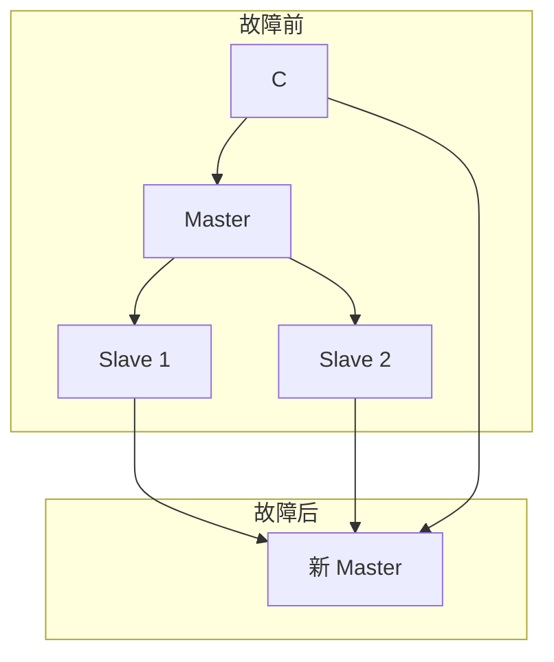
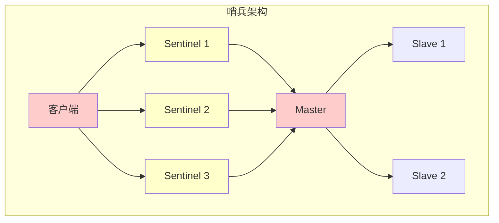
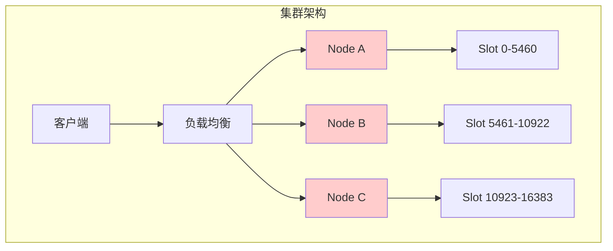
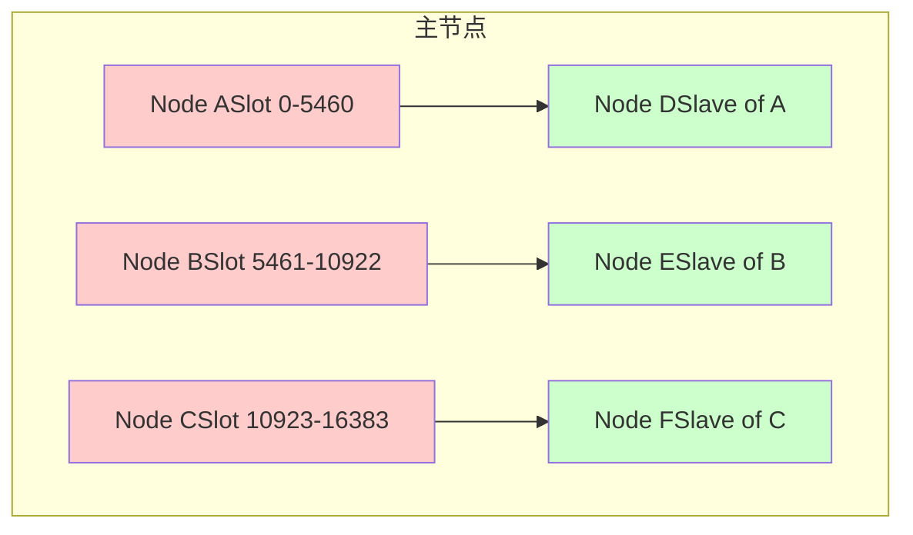
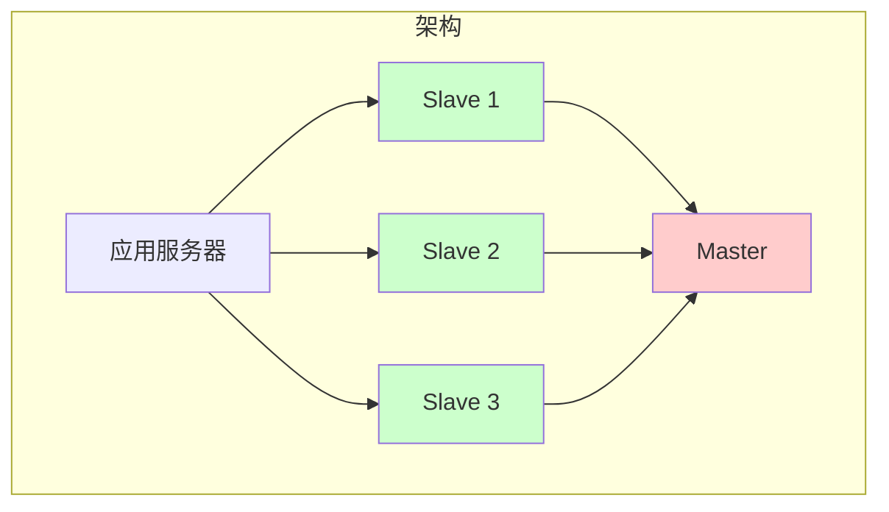
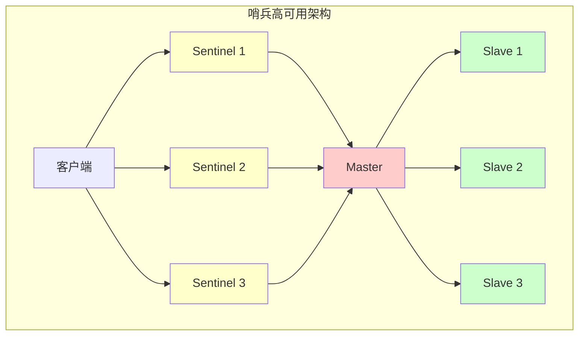
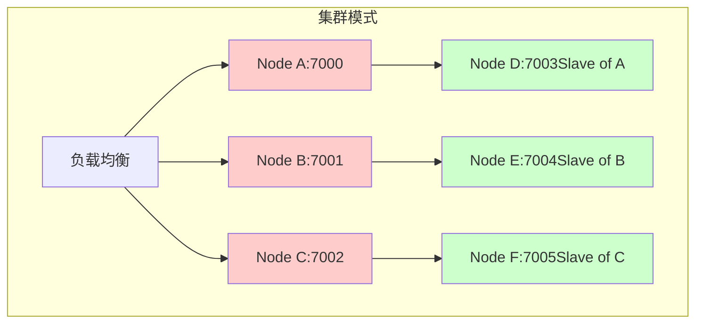

## 二、Redis 持久化

### 2.1 什么是持久化？

持久化就是将内存中的数据保存到磁盘，确保 Redis 重启后数据不会丢失。


| 方式 | 全称 | 特点 | 比喻 |
| :--- | :--- | :--- | :--- |
| RDB | Redis Database | 定时保存数据快照 | 拍照 |
| AOF | Append Only File | 记录所有写操作命令 | 写日记 |

---

### 2.2 RDB 持久化

#### 工作原理

RDB 就像给 Redis 数据"拍照"——在指定的时间点，把内存中的所有数据都保存到硬盘上的一个文件中。



#### 触发方式

```bash
# 自动触发（redis.conf）
save 900 1      # 900秒内至少有1个key变化
save 300 10     # 300秒内至少有10个key变化
save 60 10000   # 60秒内至少有10000个key变化

# 手动触发
redis-cli save          # 阻塞式保存
redis-cli bgsave        # 异步保存（后台执行）
redis-cli lastsave      # 查看上次保存时间
```

#### 优点与缺点

| 优点 | 缺点 |
| :--- | :--- |
| 文件紧凑，适合备份 | 可能会丢失最后一次快照后的数据 |
| 恢复速度快 | 需要fork子进程，会阻塞 |
| 适合灾难恢复 | 文件格式兼容性可能有问题 |

---

### 2.3 AOF 持久化

#### 工作原理

AOF 就像写"日记"——Redis 执行的每一个写操作都会被记录到文件中。


#### AOF 写入策略

| 策略 | 安全性 | 性能 | 最多丢失数据 |
| :--- | :--- | :--- | :--- |
| always | 最高 | 最慢 | 0 |
| everysec | 高 | 较快 | 1秒 |
| no | 低 | 最快 | 不确定 |

```bash
# redis.conf 配置
appendonly yes
appendfsync everysec
```

#### AOF 重写

```bash
# 手动触发重写
redis-cli bgrewriteaof

# 自动触发配置
auto-aof-rewrite-percentage 100
auto-aof-rewrite-min-size 64mb
```

---

### 2.4 持久化策略选择

| 场景 | 推荐方案 |
| :--- | :--- |
| 数据不太重要 | RDB |
| 数据非常重要 | RDB + AOF |
| 大数据量 | RDB |
| 追求极致安全 | AOF always |

---

## 三、Redis 主从复制

### 3.1 什么是主从复制？

主从复制就是有一个主服务器（Master），负责处理所有写操作；还有多个从服务器（Slave），实时从主服务器复制数据。



| 作用 | 说明 |
| :--- | :--- |
| 数据备份 | 从服务器作为数据备份 |
| 读写分离 | 主服务器写，从服务器读，分担压力 |
| 故障恢复 | 主服务器故障时，从服务器可以接管 |
| 负载均衡 | 多个从服务器分担查询压力 |

---

### 3.2 主从复制配置

#### 配置文件配置（从服务器）

```bash
# redis.conf
replicaof 192.168.1.100 6379
masterauth your_password
replica-read-only yes
```

#### 命令行配置

```bash
# 设置主服务器
redis-cli replicaof 192.168.1.100 6379

# 取消主从复制
redis-cli replicaof no one
```

---

### 3.3 主从复制原理



---

## 四、Redis 哨兵机制

### 4.1 什么是哨兵？

哨兵（Sentinel）专门负责监控主从服务器的状态，当主服务器故障时，自动把从服务器提升为新的主服务器，实现**自动故障切换**。



**哨兵的主要功能：**

| 功能 | 说明 |
| :--- | :--- |
| 监控 | 持续监控主从服务器是否正常运行 |
| 自动故障切换 | 主服务器故障时，自动选举新主服务器 |
| 通知 | 故障切换后，通知客户端新地址 |

---

### 4.2 哨兵部署架构



---

### 4.3 哨兵配置

```bash
# sentinel.conf
port 26379
daemonize yes

# 监控配置
sentinel monitor mymaster 192.168.1.100 6379 2
sentinel down-after-milliseconds mymaster 30000
sentinel parallel-syncs mymaster 1
sentinel failover-timeout mymaster 180000
```

```bash
# 启动哨兵
redis-sentinel /etc/redis/sentinel.conf

# 查看主服务器
redis-cli -p 26379 SENTINEL get-master-addr-by-name mymaster
```

---

### 4.4 Python 客户端连接哨兵

```python
import redis
from redis.sentinel import Sentinel

class SentinelRedis:
    """哨兵模式 Redis 客户端封装"""
    
    def __init__(self, sentinel_hosts, master_name):
        self.sentinel = Sentinel(
            sentinel_hosts,
            socket_timeout=0.1
        )
        self.master_name = master_name
    
    def get_master(self):
        return self.sentinel.master_for(self.master_name)
    
    def get_slave(self):
        return self.sentinel.slave_for(self.master_name)
    
    def set(self, key, value):
        return self.get_master().set(key, value)
    
    def get(self, key):
        return self.get_slave().get(key)


# 使用示例
client = SentinelRedis(
    sentinel_hosts=[
        ('192.168.1.101', 26379),
        ('192.168.1.102', 26379),
        ('192.168.1.103', 26379)
    ],
    master_name='mymaster'
)

client.set('user:1:name', 'Alice')
print(client.get('user:1:name'))
```

---

## 五、Redis 集群

### 5.1 什么是集群？

Redis 集群把数据分散存储在多台服务器上，每台服务器只负责一部分数据。



**核心概念：**

| 概念 | 说明 |
| :--- | :--- |
| 节点（Node） | 集群中的每台 Redis 服务器 |
| 槽（Slot） | 16384 个槽，0~16383，用于分配数据 |
| 故障转移 | 节点故障时自动切换 |

---

### 5.2 集群架构



---

### 5.3 集群配置

```bash
# 创建集群
redis-cli --cluster create \
  192.168.1.101:7000 \
  192.168.1.101:7001 \
  192.168.1.101:7002 \
  192.168.1.101:7003 \
  192.168.1.101:7004 \
  192.168.1.101:7005 \
  --cluster-replicas 1

# 查看集群信息
redis-cli -c -p 7000 CLUSTER INFO
redis-cli -c -p 7000 CLUSTER NODES
```

---

### 5.4 Python 连接集群

```python
import redis
from redis.cluster import RedisCluster

class ClusterClient:
    """Redis 集群客户端"""
    
    def __init__(self, nodes):
        self.rc = RedisCluster(
            startup_nodes=nodes,
            decode_responses=True,
            skip_full_coverage_check=True
        )
    
    def set(self, key, value):
        return self.rc.set(key, value)
    
    def get(self, key):
        return self.rc.get(key)
    
    def mset(self, mapping):
        return self.rc.mset(mapping)
    
    def mget(self, keys):
        return self.rc.mget(keys)


# 使用示例
cluster = ClusterClient([
    {'host': '192.168.1.101', 'port': 7000},
    {'host': '192.168.1.101', 'port': 7001},
    {'host': '192.168.1.101', 'port': 7002},
    {'host': '192.168.1.101', 'port': 7003},
    {'host': '192.168.1.101', 'port': 7004},
    {'host': '192.168.1.101', 'port': 7005},
])

cluster.set('name', 'Alice')
print(cluster.get('name'))
```

---

## 六、实战部署方案

### 6.1 中小型项目方案（单主 + 从）



**部署配置：**
- Master: 1台（写操作）
- Slave: 3台（读操作，分担压力）
- 持久化: RDB + AOF
- 适用: QPS < 10万

---

### 6.2 高可用方案（哨兵模式）



---

### 6.3 大型项目方案（集群模式）



---

## 七、常见问题与解决方案

### 7.1 持久化问题

```bash
# 问题1：RDB 文件过大，保存时间长
# 解决：调整 save 参数

# 问题2：AOF 文件过大
# 解决：配置自动重写
auto-aof-rewrite-percentage 100
auto-aof-rewrite-min-size 64mb
```

### 7.2 主从复制问题

```bash
# 问题：从服务器数据与主服务器不一致
# 解决：重新同步
redis-cli replicaof no one
redis-cli flushall
redis-cli replicaof 192.168.1.100 6379
```

### 7.3 哨兵问题

```bash
# 问题：故障切换失败
# 解决：检查 sentinel 日志
tail -f /var/log/redis/sentinel.log
```

### 7.4 集群问题

```bash
# 问题：槽位迁移失败
# 解决：使用 fix 修复
redis-cli --cluster fix 

# 问题：数据倾斜
# 解决：重新平衡
redis-cli --cluster rebalance 
```

---

## 附录

### 快速命令参考

```bash
# 持久化
redis-cli SAVE                    # 手动保存 RDB
redis-cli BGSAVE                  # 后台保存 RDB
redis-cli BGREWRITEAOF            # 重写 AOF

# 主从
redis-cli INFO replication        # 查看复制状态
redis-cli REPLICAOF    # 设置主服务器

# 哨兵
redis-cli SENTINEL masters        # 查看主服务器
redis-cli SENTINEL slaves  # 查看从服务器

# 集群
redis-cli CLUSTER INFO            # 查看集群信息
redis-cli CLUSTER NODES           # 查看节点
```

---

> 📝 **文档版本**：v1.0
> 
> 🔄 **最后更新**：2024年
> 
> 💡 **提示**：实际部署时请根据具体环境调整配置，建议先在测试环境验证