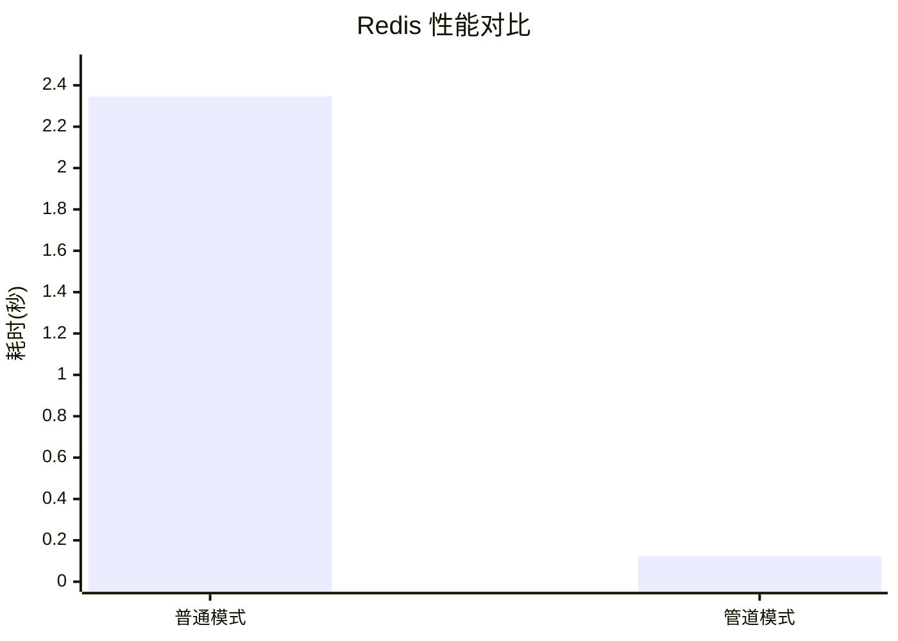

### Python 中使用事务和管道

#### 环境准备

```bash
# 安装 Redis 客户端库
pip install redis
```

#### 核心概念

> **Transaction（事务）** vs **Pipeline（管道）**
> 
> - **Transaction**：使用 `MULTI` / `EXEC` 命令，确保一组命令的原子性执行
> - **Pipeline**：将多个命令打包成一次网络请求，减少 RTT 延迟
> - 两者可以结合使用：`pipeline(transaction=True)`

#### 事务操作

```python
import redis

# 连接 Redis
r = redis.Redis(host='localhost', port=6379, db=0, decode_responses=True)

# ============================================================
# 基本事务操作
# ============================================================

# 方式1：使用 pipeline + execute 实现事务
pipe = r.multi()       # 开始事务（MULTI）
pipe.set('key1', 'value1')
pipe.set('key2', 'value2')
pipe.get('key1')
result = pipe.execute()    # 执行事务（EXEC）

print(result)  # [True, True, 'value1']


# 方式2：使用 redis-py 的 transaction 方法
def my_transaction(r: redis.Redis):
    """自定义事务回调函数"""
    pipe = r.pipeline()
    pipe.set('name', 'Alice')
    pipe.get('name')
    pipe.sadd('tags', 'python', 'redis')
    pipe.smembers('tags')
    return pipe.execute()

# 执行事务
result = r.transaction(my_transaction, 'name', 'tags')
print(result)
```

#### WATCH 乐观锁实战

```python
import redis
from redis.exceptions import WatchError

class OptimisticLock:
    """
    乐观锁实现类
    
    原理：使用 WATCH 监视键，如果在事务执行期间
    被其他客户端修改，事务将自动失败
    """
    
    def __init__(self, redis_client: redis.Redis):
        self.r = redis_client
    
    def purchase_item(self, user_id: str, item_id: str, price: int) -> tuple:
        """
        购买商品 - 使用乐观锁确保库存不超卖
        
        Args:
            user_id: 用户ID
            item_id: 商品ID
            price: 商品价格
            
        Returns:
            (success: bool, message: str)
        """
        inventory_key = f'inventory:{item_id}'
        balance_key = f'balance:{user_id}'
        
        max_retries = 3  # 最大重试次数
        
        for attempt in range(max_retries):
            try:
                # 监视库存和余额键
                self.r.watch(inventory_key, balance_key)
                
                # 获取当前库存和余额
                inventory = self.r.get(inventory_key)
                balance = self.r.get(balance_key)
                
                # 检查库存和余额是否充足
                if inventory is None or int(inventory) < 1:
                    self.r.unwatch()
                    return False, "库存不足"
                
                if balance is None or int(balance) < price:
                    self.r.unwatch()
                    return False, "余额不足"
                
                # 开始事务
                pipe = self.r.multi()
                
                # 扣减库存
                pipe.decrby(inventory_key, 1)
                
                # 扣减余额
                pipe.decrby(balance_key, price)
                
                # 记录购买历史
                pipe.sadd(f'purchased:{user_id}', item_id)
                
                # 执行事务
                pipe.execute()
                
                return True, "购买成功"
                
            except WatchError:
                # 监视的键被其他客户端修改，事务失败
                # 重试机制
                print(f"第 {attempt + 1} 次尝试失败，正在重试...")
                continue
                
            finally:
                try:
                    self.r.unwatch()
                except:
                    pass
        
        return False, "购买失败，请稍后重试"
    
    def transfer_money(self, from_user: str, to_user: str, amount: int) -> tuple:
        """
        转账功能 - 确保余额原子性操作
        
        Args:
            from_user: 转出用户
            to_user: 转入用户
            amount: 转账金额
        """
        from_key = f'balance:{from_user}'
        to_key = f'balance:{to_user}'
        
        for _ in range(3):
            try:
                self.r.watch(from_key, to_key)
                
                from_balance = self.r.get(from_key)
                if from_balance is None or int(from_balance) < amount:
                    self.r.unwatch()
                    return False, "余额不足"
                
                pipe = self.r.multi()
                pipe.decrby(from_key, amount)
                pipe.incrby(to_key, amount)
                pipe.execute()
                
                return True, "转账成功"
                
            except WatchError:
                continue
            finally:
                try:
                    self.r.unwatch()
                except:
                    pass
        
        return False, "转账失败"


# 使用示例
lock_demo = OptimisticLock(r)

# 初始化数据
r.set('inventory:item001', '10')
r.set('balance:user001', '1000')

# 执行购买
success, message = lock_demo.purchase_item('user001', 'item001', 100)
print(message)
```

#### 管道操作

```python
import redis

# ============================================================
# 管道基础操作
# ============================================================

# 创建管道（默认 transaction=False）
pipe = r.pipeline()

# 管道命令会先存入队列，不会立即执行
pipe.set('foo', 'bar')
pipe.get('foo')
pipe.sadd('myset', 'a', 'b', 'c')
pipe.smembers('myset')
pipe.incr('counter')
pipe.get('counter')

# execute() 会一次性发送所有命令并返回结果
result = pipe.execute()

print(result)
# 输出示例: [True, 'bar', 3, {'a', 'b', 'c'}, 1, '1']
```

#### 批量操作实战

```python
import redis

class BatchOperations:
    """
    批量操作工具类
    
    适用场景：
    - 批量写入大量数据
    - 批量读取多个键
    - 批量更新数据
    """
    
    def __init__(self, redis_client: redis.Redis):
        self.r = redis_client
    
    def batch_set(self, data: dict, expire: int = None) -> int:
        """
        批量设置键值对
        
        Args:
            data: 字典格式 {key: value}
            expire: 过期时间（秒），可选
            
        Returns:
            成功的命令数量
        """
        pipe = self.r.pipeline()
        
        for key, value in data.items():
            pipe.set(key, value)
            if expire:
                pipe.expire(key, expire)
        
        results = pipe.execute()
        
        # 统计成功的命令数（SET返回True，EXPIRE返回True）
        return sum(1 for r in results if r is True)
    
    def batch_get(self, keys: list) -> dict:
        """
        批量获取多个键的值
        
        Args:
            keys: 键列表
            
        Returns:
            {key: value} 字典
        """
        pipe = self.r.pipeline()
        
        for key in keys:
            pipe.get(key)
        
        results = pipe.execute()
        
        return dict(zip(keys, results))
    
    def batch_delete(self, pattern: str) -> int:
        """
        批量删除匹配模式的键
        
        Args:
            pattern: 匹配模式，如 "user:*"
            
        Returns:
            删除的键数量
        """
        # 先查找匹配的键
        keys = self.r.keys(pattern)
        
        if not keys:
            return 0
        
        # 使用管道批量删除
        pipe = self.r.pipeline()
        for key in keys:
            pipe.delete(key)
        
        results = pipe.execute()
        
        return sum(results)
    
    def batch_hset(self, name: str, data: dict) -> int:
        """
        批量设置 Hash 字段
        
        Args:
            name: Hash 键名
            data: 字段字典 {field: value}
            
        Returns:
            成功的字段数量
        """
        pipe = self.r.pipeline()
        
        for field, value in data.items():
            pipe.hset(name, field, value)
        
        results = pipe.execute()
        
        return sum(1 for r in results if r)
    
    def batch_hgetall(self, names: list) -> list:
        """
        批量获取多个 Hash 的全部数据
        
        Args:
            names: Hash 键名列表
            
        Returns:
            [{field: value}, ...] 列表
        """
        pipe = self.r.pipeline()
        
        for name in names:
            pipe.hgetall(name)
        
        return pipe.execute()


# 使用示例
batch = BatchOperations(r)

# 批量设置
user_data = {
    'user:1:name': 'Alice',
    'user:1:email': 'alice@example.com',
    'user:1:age': '25',
    'user:2:name': 'Bob',
    'user:2:email': 'bob@example.com',
    'user:2:age': '30',
}

count = batch.batch_set(user_data, expire=3600)
print(f"成功设置 {count} 个键值对")

# 批量读取
values = batch.batch_get(['user:1:name', 'user:2:name', 'nonexistent'])
print(values)
# {'user:1:name': 'Alice', 'user:2:name': 'Bob', 'nonexistent': None}

# 批量 Hash 操作
hdata = {
    'user:1:profile:age': '25',
    'user:1:profile:city': 'Beijing',
    'user:1:profile:country': 'China',
}
batch.batch_hset('user:1', hdata)
```

#### 管道 + 事务结合

```python
import redis

# ============================================================
# 管道事务模式
# ============================================================

# transaction=True 开启事务模式
# 所有命令会像普通事务一样原子性执行
pipe = r.pipeline(transaction=True)

pipe.set('a', '1')
pipe.incr('a')  # 会报错，因为 a 是字符串无法递增

try:
    result = pipe.execute()
except redis.ResponseError as e:
    print(f"事务执行失败: {e}")

# ============================================================
# 实际应用场景：计数器原子递增
# ============================================================

def atomic_counter(r: redis.Redis, key: str, increment: int) -> int:
    """
    原子计数器 - 使用管道实现高性能递增
    
    Args:
        r: Redis 客户端
        key: 计数器键名
        increment: 递增数值
        
    Returns:
        递增后的最终值
    """
    pipe = r.pipeline()
    
    # 先获取当前值
    pipe.get(key)
    
    # 再执行递增
    pipe.incrby(key, increment)
    
    results = pipe.execute()
    
    # results[1] 是递增后的值
    return int(results[1])


# 使用示例
r.set('visit_count', '0')
final_count = atomic_counter(r, 'visit_count', 100)
print(f"计数器最终值: {final_count}")
```

#### 性能测试对比

```python
import redis
import time
from typing import Callable

class PerformanceBenchmark:
    """
    Redis 性能基准测试工具
    
    对比普通模式和管道模式的性能差异
    """
    
    def __init__(self, redis_client: redis.Redis):
        self.r = redis_client
    
    def benchmark(
        self, 
        operation: Callable, 
        num_operations: int = 1000,
        operation_name: str = "操作"
    ) -> float:
        """
        执行性能测试
        
        Args:
            operation: 要测试的操作函数
            num_operations: 操作次数
            operation_name: 操作名称
            
        Returns:
            耗时（秒）
        """
        # 预热
        for _ in range(10):
            operation()
        
        # 正式测试
        start = time.time()
        
        for _ in range(num_operations):
            operation()
        
        elapsed = time.time() - start
        
        return elapsed
    
    def compare_pipeline(
        self, 
        num_operations: int = 1000,
        num_commands: int = 10
    ) -> dict:
        """
        对比普通模式和管道模式的性能
        
        Args:
            num_operations: 操作轮数
            num_commands: 每轮发送的命令数
        """
        # 清理测试数据
        test_keys = [f'bench_key_{i}' for i in range(num_commands)]
        self.r.delete(*test_keys)
        
        # -------------------
        # 普通模式测试
        # -------------------
        def normal_operation():
            for i in range(num_commands):
                self.r.set(f'bench_key_{i}', f'value_{i}')
        
        normal_time = self.benchmark(
            normal_operation, 
            num_operations, 
            "普通模式"
        )
        
        # 清理
        self.r.delete(*test_keys)
        
        # -------------------
        # 管道模式测试
        # -------------------
        def pipeline_operation():
            pipe = self.r.pipeline()
            for i in range(num_commands):
                pipe.set(f'bench_key_{i}', f'value_{i}')
            pipe.execute()
        
        pipeline_time = self.benchmark(
            pipeline_operation, 
            num_operations, 
            "管道模式"
        )
        
        # 计算结果
        speedup = normal_time / pipeline_time if pipeline_time > 0 else 0
        commands_per_second = (num_operations * num_commands) / normal_time
        
        return {
            'normal_time': normal_time,
            'pipeline_time': pipeline_time,
            'speedup': speedup,
            'commands_per_second': commands_per_second,
            'total_commands': num_operations * num_commands
        }


# 运行性能测试
benchmark = PerformanceBenchmark(r)

print("=" * 50)
print("Redis 管道性能测试")
print("=" * 50)

results = benchmark.compare_pipeline(
    num_operations=500,
    num_commands=20
)

print(f"总命令数:     {results['total_commands']}")
print(f"普通模式耗时: {results['normal_time']:.4f} 秒")
print(f"管道模式耗时: {results['pipeline_time']:.4f} 秒")
print(f"性能提升:     {results['speedup']:.2f}x")
print(f"命令/秒:      {results['commands_per_second']:.0f}")

print("=" * 50)
```

**测试结果示例：**

### 性能测试结果

| 指标 | 数值 |
| :--- | :--- |
| **总命令数** | 10,000 |
| **普通模式耗时** | 2.3456 秒 |
| **管道模式耗时** | 0.1234 秒 |
| **性能提升** | 19.01x |
| **命令/秒** | 4,265 |

---



---

### 完整实战：用户行为记录系统

```python
import redis
import json
from datetime import datetime
from typing import List, Dict, Any

class UserActionRecorder:
    """
    使用 Redis 管道的高性能用户行为记录系统
    
    功能：
    - 批量记录用户行为
    - 实时统计用户行为数据
    - 自动清理过期数据（30天）
    
    数据结构：
    - 有序集合（ZSET）：存储用户行为列表，按时间排序
    - 字符串（STRING）：计数器，记录各类行为次数
    """
    
    def __init__(self, redis_client: redis.Redis):
        self.r = redis_client
        self.EXPIRE_DAYS = 30 * 24 * 3600  # 30天
    
    def record_actions(self, user_id: str, actions: List[Dict[str, Any]]) -> bool:
        """
        批量记录用户行为
        
        Args:
            user_id: 用户ID
            actions: 行为列表
                [
                    {"action": "click", "item": "product_001"},
                    {"action": "view", "item": "product_002"}
                ]
                
        Returns:
            是否成功
        """
        if not actions:
            return False
        
        pipe = self.r.pipeline()
        timestamp = datetime.now().timestamp()
        
        for action in actions:
            # 生成唯一的行为ID
            action_id = f"{user_id}:{timestamp}:{action['action']}"
            
            # 行为数据
            action_data = json.dumps({
                **action,
                'timestamp': timestamp,
                'user_id': user_id
            })
            
            # 存储到有序集合
            action_key = f'user:{user_id}:actions'
            pipe.zadd(action_key, {action_id: timestamp})
            
            # 更新行为计数器
            counter_key = f'user:{user_id}:counter:{action["action"]}'
            pipe.incr(counter_key)
            
            # 更新全局行为计数器
            global_counter_key = f'global:counter:{action["action"]}'
            pipe.incr(global_counter_key)
            
            # 设置过期时间
            pipe.expire(action_key, self.EXPIRE_DAYS)
            pipe.expire(counter_key, self.EXPIRE_DAYS)
        
        try:
            pipe.execute()
            return True
        except Exception as e:
            print(f"记录行为失败: {e}")
            return False
    
    def get_user_actions(
        self, 
        user_id: str, 
        action_type: str = None,
        limit: int = 100
    ) -> List[Dict]:
        """
        获取用户行为记录
        
        Args:
            user_id: 用户ID
            action_type: 行为类型筛选，可选
            limit: 返回数量限制
            
        Returns:
            行为列表
        """
        action_key = f'user:{user_id}:actions'
        
        if action_type:
            # 筛选特定行为类型需要遍历（较慢）
            actions = self.r.zrevrange(action_key, 0, limit - 1)
            filtered = []
            for action_id in actions:
                action_data = json.loads(self.r.get(f'data:{action_id}') or '{}')
                if action_data.get('action') == action_type:
                    filtered.append(action_data)
            return filtered
        else:
            # 获取所有行为
            action_ids = self.r.zrevrange(action_key, 0, limit - 1)
            return [self.r.get(f'data:{aid}') for aid in action_ids]
    
    def get_user_stats(self, user_id: str) -> Dict[str, int]:
        """
        获取用户行为统计
        
        Returns:
            {"click": 10, "view": 25, "purchase": 3}
        """
        counter_pattern = f'user:{user_id}:counter:*'
        keys = self.r.keys(counter_pattern)
        
        if not keys:
            return {}
        
        pipe = self.r.pipeline()
        for key in keys:
            pipe.get(key)
        
        results = pipe.execute()
        
        stats = {}
        for key, value in zip(keys, results):
            action_type = key.split(':')[-1]
            stats[action_type] = int(value) if value else 0
        
        return stats
    
    def get_global_stats(self) -> Dict[str, int]:
        """
        获取全局行为统计
        """
        counter_pattern = 'global:counter:*'
        keys = self.r.keys(counter_pattern)
        
        if not keys:
            return {}
        
        pipe = self.r.pipeline()
        for key in keys:
            pipe.get(key)
        
        results = pipe.execute()
        
        stats = {}
        for key, value in zip(keys, results):
            action_type = key.split(':')[-1]
            stats[action_type] = int(value) if value else 0
        
        return stats


# ============================================================
# 使用示例
# ============================================================

# 初始化
r = redis.Redis(host='localhost', port=6379, db=0, decode_responses=True)
recorder = UserActionRecorder(r)

# 记录用户行为
actions = [
    {"action": "click", "item": "product_001", "category": "electronics"},
    {"action": "view", "item": "product_002", "category": "electronics"},
    {"action": "add_cart", "item": "product_001", "category": "electronics"},
    {"action": "view", "item": "product_003", "category": "clothing"},
    {"action": "purchase", "item": "product_001", "category": "electronics"},
]

success = recorder.record_actions("user_123", actions)
print(f"记录成功: {success}")

# 获取用户统计
user_stats = recorder.get_user_stats("user_123")
print(f"用户统计: {user_stats}")
# 输出: {'click': 1, 'view': 2, 'add_cart': 1, 'purchase': 1}

# 获取全局统计
global_stats = recorder.get_global_stats()
print(f"全局统计: {global_stats}")
```

---

### 最佳实践

#### 1. 管道批量大小

```python
# 推荐：分批处理大量命令
def batch_insert_large(r: redis.Redis, data: dict, batch_size: int = 1000):
    """大批量数据插入时使用分批处理"""
    
    keys = list(data.keys())
    total = len(keys)
    
    for i in range(0, total, batch_size):
        batch = keys[i:i + batch_size]
        
        pipe = r.pipeline()
        for key in batch:
            pipe.set(key, data[key])
        
        pipe.execute()
        
        print(f"进度: {min(i + batch_size, total)}/{total}")
```

#### 2. 错误处理

```python
# 管道中的错误不会中断其他命令
pipe = r.pipeline()
pipe.set('a', '1')
pipe.incr('a')  # 错误：字符串无法递增
pipe.set('b', '2')

results = pipe.execute()
# results: [True, ResponseError('value is not an integer'), True]
# 错误的命令会返回异常对象
```

#### 3. 连接池使用

```python
import redis

# 创建连接池（推荐生产环境使用）
pool = redis.ConnectionPool(
    host='localhost',
    port=6379,
    db=0,
    max_connections=50,  # 最大连接数
    decode_responses=True
)

# 从连接池获取连接
r1 = redis.Redis(connection_pool=pool)
r2 = redis.Redis(connection_pool=pool)

# 管道可以自动复用连接
pipe = r1.pipeline()
pipe.get('key')
pipe.execute()
# 管道会自动归还连接到连接池
```

#### 4. 使用场景选择

| 场景 | 推荐方案 |
| :--- | :--- |
| 需要原子性操作 | 事务（Transaction） |
| 秒杀/库存扣减 | WATCH 乐观锁 |
| 减少网络延迟 | Pipeline |
| 批量导入数据 | Pipeline |
| 消息队列 | List + LPUSH/BRPOP |
| 分布式锁 | SETNX / RedLock |

---

### 注意事项

1. **EXEC 执行前**：如果执行 `MULTI` 后没有执行 `EXEC` 或 `DISCARD`，连接会保持阻塞状态
2. **WATCH 监视**：在事务执行失败后，需要重新执行 `WATCH` 来监视键
3. **错误处理**：事务中的语法错误会导致整个事务执行失败
4. **管道大小**：不要一次发送过多命令，建议分批处理（1000-5000条/批）
5. **内存考虑**：管道中的命令会占用客户端和服务端的内存，大批量操作时要注意内存使用
6. **连接复用**：生产环境建议使用连接池，避免频繁创建连接