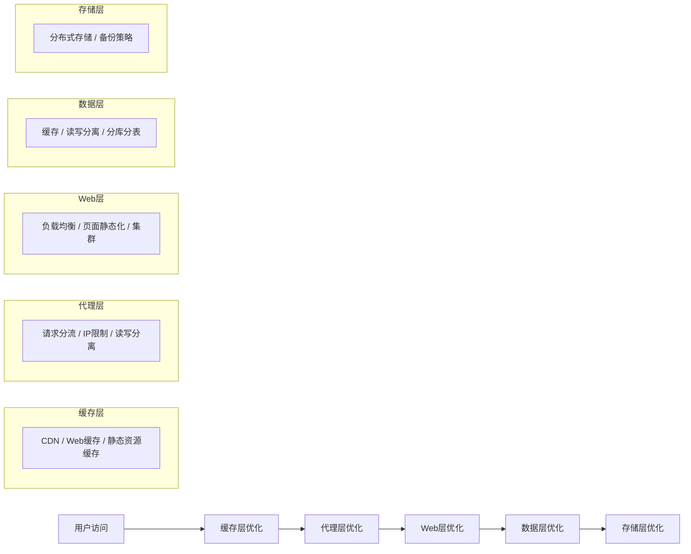

# 部署串讲

---

## 1. 部署项目

### 学习目标

- 了解网站架构演变流程
- 了解网站架构部署原则

---

### 1.1 架构演变

> 这一节的目的就是让大家来了解一下，互联网的软件项目架构一般的发展过程。

#### 项目的架构组成

一般来说，任何一个项目至少有三层内容来组成：

| 层级 | 说明 |
|------|------|
| Web 访问层 | 处理用户请求和响应 |
| 数据库层 | 存储和管理数据 |
| 存储层 | 存放静态文件和多媒体资源 |

---

#### 架构演变流程

| 阶段 | 常见场景 | 部署特点 | 应用特点 |
|------|----------|----------|----------|
| **单体阶段** | 项目初期 | 所有应用服务都在一台主机 | 开发简单 |
| **应用/数据分离阶段** | 用户访问数据库有压力 | 应用和数据库单独部署 | 开发简单 |
| **页面动静分离阶段** | 用户访问页面有压力 | 静态资源和动态请求分离 | 开发简单 |
| **页面/数据缓存阶段** | 用户访问有压力 | 代理和数据库前面增加缓存组件 | 开发简单 |
| **应用服务集群阶段** | 用户访问有压力 | 应用服务做集群负载均衡 | 业务中等 |
| **数据库读写分离化** | 用户访问数据有压力 | 数据库集群做读写分离，静态文件做共享存储 | 业务中等 |
| **Nginx 存储分布式** | 数据存储有压力 | 数据库分库/分表扩展，数据文件使用分布式存储 | 业务中等 |
| **业务应用拆分** | 业务访问/团队管理有压力 | 项目应用进行拆分 | 业务复杂 |
| **业务拆分** | 业务处理有压力 | 所有功能以服务形式单独部署，引入配置管理中心、消息中间件、搜索引擎 | 业务复杂 |
| **微服务阶段** | 项目后期，精益求精 | 所有服务都可以自由部署 | 业务复杂 |

---

### 1.2 架构部署

#### 架构定位

| 级别 | 定位 | 说明 |
|------|------|------|
| **一级定位** | 核心组成部分 | Web 层、数据层、存储层 |
| **二级定位** | 功能增强部分 | Web 缓存、代理、数据库缓存 |

#### 部署原则

| 层级 | 部署原则 |
|------|----------|
| **一级角色** | 站在用户访问资源角度，从后向前依次部署 |
| **二级角色** | 站在用户访问资源压力角度，需要部署哪里就部署哪里，注意前后信息交流 |

---

## 2. 项目运营

### 学习目标

- 了解常见网站质量分析指标及其特点
- 知道常见网站优化思路

---

### 2.1 网站分析

#### 常见术语

| 术语 | 全称 | 说明 |
|------|------|------|
| **IP** | Independent IP | 独立IP数，指一天内使用不同IP地址的用户访问网站的数量。同一个IP无论访问多少网页，独立IP数均为1 |
| **PV** | Page View | 页面浏览量，指一天内网站的浏览次数。用户每打开一个页面就记录一次 |
| **UV** | Unique Visitor | 访问网站的用户，指一天内访问某站点的人数，以cookie/客户端为依据。同一访问用户多次访问只记录1次 |
| **VV** | Visit View | 用户访问网站次数，指一天内某个用户访问了多少次网站。打开网页浏览完毕后关闭，表示一次访问 |
| **BR** | Bounce Rate | 跳出率，指一天内访问用户中，没有做任何事情就离开的比例。跳出率高说明网页吸引力不足 |
| **CR** | Conversion Rate | 转化率，指一天内访问用户中，继续浏览其他页面的比例。一般体现在项目关键流程部分 |

#### 术语使用场景

| 场景 | 常用术语 | 适用人员 |
|------|----------|----------|
| 口语描述 | IP、PV、UV | 所有岗位 |
| 网站质量 | 跳出率、转化率 | 产品、研发 |

#### 常见分析工具

- **服务器日志**：Apache/Nginx 日志分析
- **内部监控平台**：Prometheus、Grafana
- **互联网分析工具**：站长工具、百度统计、云平台监控

---

### 2.2 网站优化

#### 网站优化思路

> 关于项目正常运行，就是网站运行过程中，不论遇到什么问题，我们都能应对下去。一般来说就是用户访问量变化的时候我们做的优化等工作。

---

##### 缓存层方面

| 问题 | 解决思路 |
|------|----------|
| 怎么在现有主机资源情况下，花最小代价抗住大量用户访问量？ | 自建 Web 缓存或购买 CDN，将用户经常访问的、更新频率低的资源存放起来。防止恶意访问/爬虫，做好相应安全措施。缓存措施要适合公司当前业务 |

---

##### 代理层方面

| 问题 | 解决思路 |
|------|----------|
| 如何提高用户高质量的请求分发？ | 基于请求关键字进行合理分流、基于 IP 信息封闭恶意访问、基于浏览器信息分发到相应后端应用、基于协议方法做好读写分离业务精确分流、基于路径信息做好指定业务精确分流 |
| upstream 和 location 规则过多导致 URL 404 问题？ | 1. 按功能描述将 upstream 拆分到不同功能目录 2. location 匹配规则尽量描述清楚，用 `^/$` 锚定首尾 |

---

##### 项目后端 Web 访问

| 问题 | 解决思路 |
|------|----------|
| 动态 Web 请求过多，压力较大 | 分析瓶颈点： - **请求量大**：Web 缓存/CDN，或动态 Web 集群 - **数据库操作多**：分析请求内容是否频繁/集中，是则页面静态化；否则参看数据库演变思路 |
| 如何提高静态 Web 资源访问质量？ | 结合前端缓存功能，在代码或代理部分设置合理的资源缓存过期时间，定时/实时推送相关信息到前端缓存层 |

---

##### 数据层方面

| 问题 | 解决思路 |
|------|----------|
| 用户访问数据有压力 | **读取频繁**：前端数据缓存、分布式数据缓存、优化查询搜索 **写入频繁**：数据库集群、读写分离、分库分表、增加数据管理层 |
| **开发角度** | 关注数据库表的设计，表索引合理，查询时尽量使用条件查询 |

---

##### 存储层方面

| 问题 | 解决思路 |
|------|----------|
| 如何保证数据存储的质量？ | 存储设备的购买质量、分布式存储、备份策略 |

---

## 总结

### 网站架构演变

---
